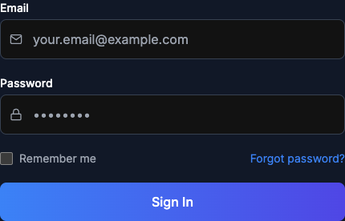
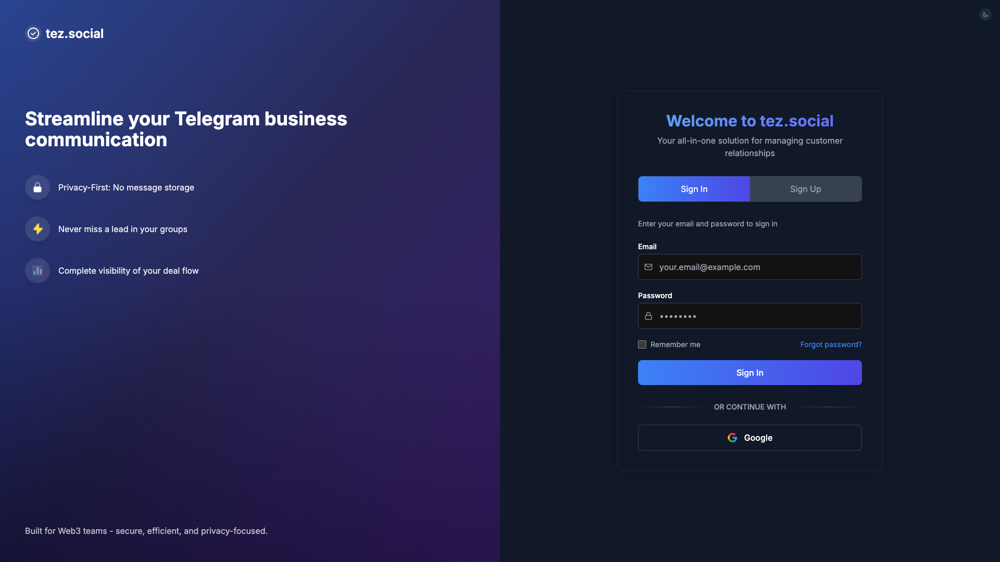

# Tez Frontend Complete Documentation

## Table of Contents

- [Dashboard Page](#dashboard-page)
- [Pipeline Page](#pipeline-page)
- [Deal Page](#deal-page)
- [Ai-assistant Page](#ai-assistant-page)
- [Auth Page](#auth-page)
- [Organization-info Page](#organization-info-page)
- [Chat-sync Page](#chat-sync-page)

## Overview

Tez Frontend is a comprehensive CRM application designed for sales teams. It provides pipeline management, deal tracking, AI assistance, and more.

## Dashboard Page

#### Overview

The dashboard page provides users with a comprehensive overview of their sales metrics, activities, and performance.

#### Screenshots

*Screenshots could not be generated for this page.*

#### Usage Guide

1. **Key Performance Indicators**: View important metrics at the top of the page
2. **Charts and Graphs**: Analyze sales data visually
3. **Active Deals**: See your most important deals that need attention
4. **Tasks**: Track your upcoming tasks and deadlines
5. **Recent Activity**: Monitor the latest actions across your pipeline

## Pipeline Page

#### Overview

The pipeline page provides users with a kanban-style view to manage their sales pipeline and track deals through various stages.

#### Screenshots

#### Components

#### Buttons 1.png (Light Mode)

#### Buttons 2.png (Light Mode)

#### Buttons 3.png (Light Mode)

#### Card Dragging.png (Light Mode)

#### Default View.png (Light Mode)

#### Full.png (Light Mode)

#### Header 1.png (Light Mode)

#### Main Content 1.png (Light Mode)

#### Sidebar Collapsed.png (Light Mode)

#### Usage Guide

1. **Pipeline Selection**: Use the dropdown to switch between different pipelines
2. **View Toggle**: Switch between Kanban and List views
3. **Filters**: Filter deals by various criteria
4. **Deal Cards**: Drag and drop deals between pipeline stages
5. **Add Deal**: Create new deals directly from the pipeline view

## Deal Page

#### Overview

The deal page provides users with detailed information about specific deals, including customer data, deal value, and communication history.

#### Screenshots

*Screenshots could not be generated for this page.*

#### Usage Guide

1. **Deal Information**: View customer details, deal value, and status
2. **Timeline**: Track all communications and activities related to the deal
3. **Notes**: Add important notes and information
4. **Related Tasks**: Manage tasks specifically related to this deal
5. **Deal Actions**: Update deal status, schedule follow-ups, or close the deal

## Ai-assistant Page

#### Overview

The ai-assistant page provides users with AI-powered assistance for sales queries and training the system with organization-specific knowledge.

#### Screenshots

*Screenshots could not be generated for this page.*

#### Usage Guide

1. **Training Status**: Monitor how much data has been trained into your AI assistant
2. **Q&A Testing**: Test how the AI responds to typical customer questions
3. **Feedback Tools**: Provide feedback on AI responses to improve future answers
4. **Custom Questions**: Ask your own questions to see how the AI performs

## Auth Page

#### Overview

The auth page provides users with secure login and registration capabilities.

#### Screenshots

#### Components

#### Buttons 1.png (Light Mode)

#### Buttons 2.png (Light Mode)

#### Buttons 3.png (Light Mode)

#### Forms 1.png (Light Mode)

#### Full.png (Light Mode)

#### Inputs 1.png (Light Mode)

#### Inputs 2.png (Light Mode)

#### Inputs 3.png (Light Mode)

#### Usage Guide

1. **Login**: Existing users can sign in with their credentials
2. **Sign Up**: New users can create an account
3. **Password Reset**: Users can request a password reset if needed

## Organization-info Page

#### Overview

The organization-info page provides users with the ability to manage their organization details and preferences.

#### Screenshots

*Screenshots could not be generated for this page.*

#### Usage Guide

1. **Organization Details**: Update company name, logo, and contact information
2. **Team Members**: Manage users with access to your organization
3. **Preferences**: Set organization-wide preferences and defaults
4. **Save Changes**: Apply updates to your organization profile

## Chat-sync Page

#### Overview

The chat-sync page provides users with tools to connect and synchronize with external messaging platforms.

#### Screenshots

*Screenshots could not be generated for this page.*

#### Usage Guide

1. **Connect Accounts**: Link external messaging accounts
2. **Sync Settings**: Configure which messages to import and how to categorize them
3. **Sync Status**: Monitor the status of synchronization processes
4. **Connected Accounts**: View and manage your connected accounts