# Pipeline Page - Comprehensive Documentation

## Table of Contents

- [Overview](#overview)
- [Design System](#design-system)
- [Page Layout](#page-layout)
- [Component Hierarchy](#component-hierarchy)
- [Core Features](#core-features)
- [UI Components](#ui-components)
- [User Interactions](#user-interactions)
- [States and Variations](#states-and-variations)
- [Technical Implementation](#technical-implementation)
- [Performance Considerations](#performance-considerations)
- [Accessibility](#accessibility)
- [Edge Cases](#edge-cases)
- [Benchmark Results](#benchmark-results)

## Overview

The Pipeline page provides a visual interface for managing sales deals through different stages of the sales process. It implements a kanban-style board interface where cards (representing deals) can be moved between columns (representing pipeline stages).

**Key Value Proposition:** Enables users to visualize their entire sales pipeline at a glance and track deal progression efficiently.

### Dark Mode


### Light Mode
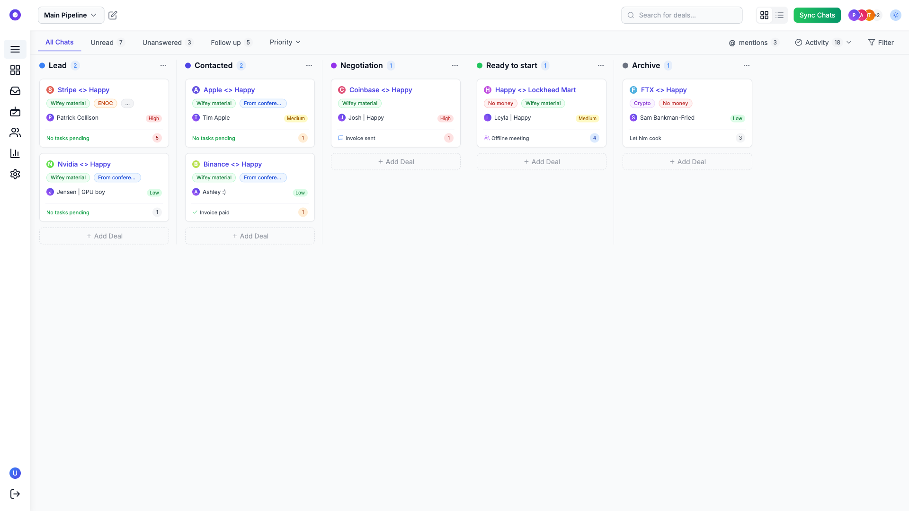

## Design System

### Color Palette

The Pipeline page follows the application's color system:

- **Dark Mode:**
  - Background: Dark gray (#1E1E1E)
  - Cards: Medium gray (#2A2A2A)
  - Text: White (#FFFFFF) and light gray (#E0E0E0)
  - Accents: Brand primary color

- **Light Mode:**
  - Background: Off-white (#F8F8F8)
  - Cards: White (#FFFFFF) with subtle shadows
  - Text: Dark gray (#333333) and medium gray (#666666)
  - Accents: Brand primary color

### Typography

- Headings: Inter/SF Pro Display, 18-24px
- Body text: Inter/SF Pro Text, 14-16px
- Labels and metadata: Inter/SF Pro Text, 12-14px
- Monospaced data (amounts, dates): Source Code Pro/SF Mono, 14px

### Spacing System

- Consistent 4px grid system (4px, 8px, 16px, 24px, 32px, 64px)
- Card padding: 16px
- Column spacing: 24px
- Section spacing: 32px

## Page Layout

### Header Component


The header contains:
- Page title "Pipeline"
- Pipeline selector dropdown
- Search functionality for deals
- View toggle between Kanban/List
- Action buttons (Add Deal, etc.)
- Team members avatars with tooltips
- Sync Chats button
- User profile/account menu
- Theme toggle

### Pipeline Menu Dropdown
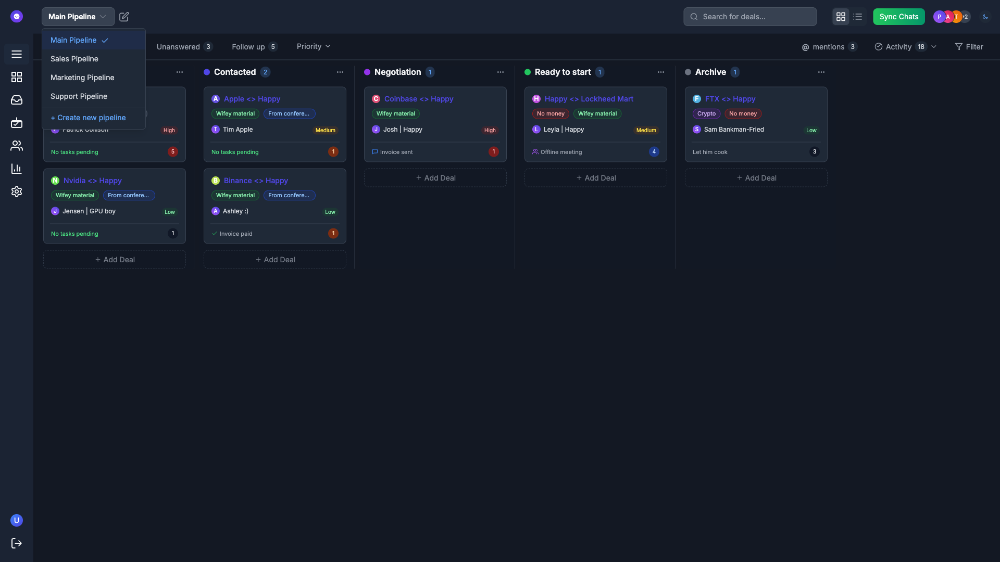

The pipeline dropdown menu allows users to:
- Select different pipeline views
- Manage pipeline settings
- Create new pipelines
- Filter deals by pipeline

### Pipeline Edit Button


Located near the pipeline dropdown, this button opens a popup modal for editing pipeline settings. The modal features animated transitions for a smooth user experience and provides quick access to pipeline configuration options.

### Edit Pipeline Modal
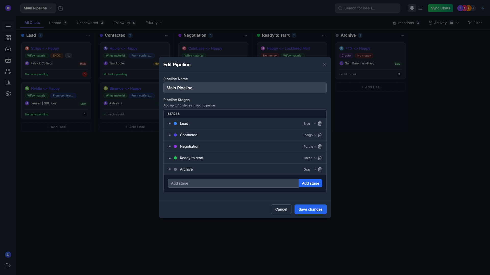

The Edit Pipeline modal appears when clicking the edit icon next to the main pipeline dropdown. It provides a comprehensive interface for configuring pipeline settings with the following components:

#### Modal Header
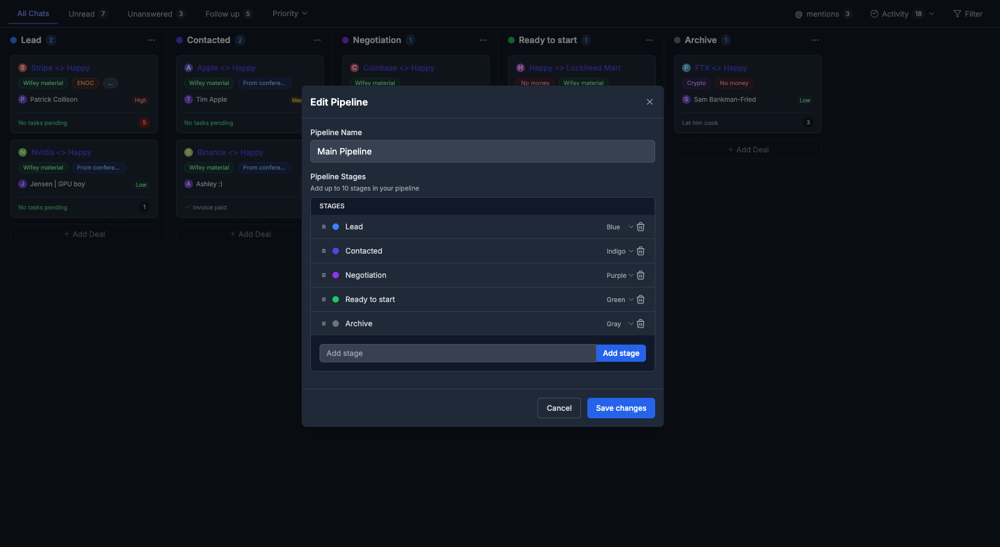

The header contains the modal title "Edit Pipeline" and a close button.

#### Pipeline Name Section
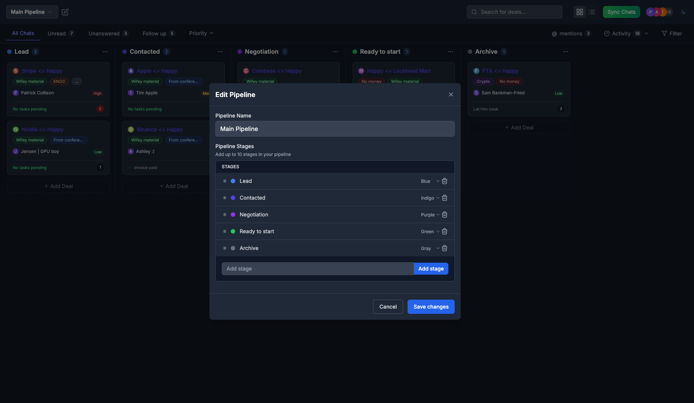

This section allows users to rename the pipeline, with an input field that updates the pipeline title.

#### Pipeline Stages Section


This section displays all stages in the pipeline, with the ability to:
- Drag and reorder stages using the handle on the left
- Edit stage names inline
- Change stage colors using dropdown selectors
- Delete stages with the trash icon

#### Individual Stage Items


Each stage item features:
- A drag handle for reordering
- A color indicator dot
- An editable name field
- A color selector dropdown
- A delete button

#### Add Stage Section


The add stage section allows users to create new pipeline stages with:
- An input field for the stage name
- An "Add stage" button to create the new stage
- Support for adding up to 10 stages

#### Modal Footer
The modal footer contains:
- A "Cancel" button to dismiss changes
- A "Save changes" button to apply pipeline configuration changes

### Main Content: Pipeline Board

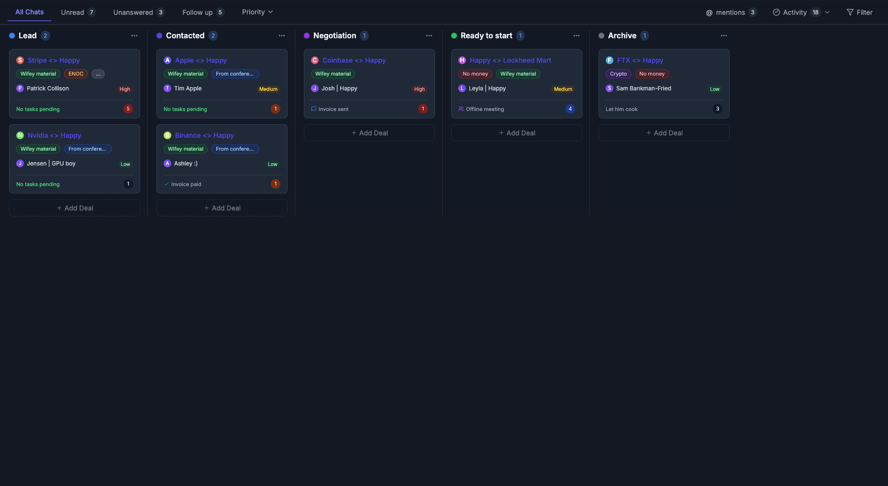

The pipeline board consists of:
- Horizontally scrollable columns
- Column headers with stage names and deal counts
- Vertically scrollable deal cards within columns
- Empty state indicators when columns have no deals
- TabsSection with filters (All, Unread, Unanswered, Follow up)
- Priority and Activity filters

### Pipeline Columns
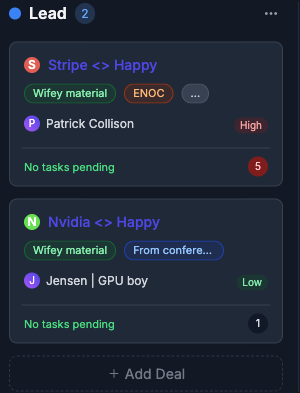


Each column represents a stage in the sales pipeline:
- Lead
- Qualified
- Proposal
- Negotiation
- Closed Won
- Closed Lost

Column properties:
- Fixed width
- Vertical scrolling for many cards
- Deal count indicator
- Total value indicator (sum of all deals)
- Add card button in each column

## Component Hierarchy

```
- PipelinePage
  |- AppLayout (shared)
  |- Header
     |- PipelineDropdown
     |- PipelineEditButton
     |- SearchComponent
     |- ViewToggle (Kanban/List)
     |- ActionButtons
     |- TeamMembers
     |- ThemeToggle
  |- TabsSection
     |- MainTabs
     |- PriorityDropdown
     |- ActivityDropdown
  |- KanbanView
     |- ColumnContainer
        |- Column (multiple)
           |- ColumnHeader
           |- CardContainer
              |- Card (multiple)
                 |- GroupLogo
                 |- Tags
                 |- Contact
                 |- Priority
                 |- Status
  |- ListView
     |- Table
        |- TableHeader
        |- TableBody
           |- TableRow (multiple)
              |- CompanyCell
              |- StageCell
              |- OwnerCell
              |- PriorityCell
              |- ValueCell
              |- StatusCell
  |- PipelineEditorModal
```

This hierarchy shows how components are structured to create both the Kanban and List views of the pipeline. The page implements a responsive design pattern where components adapt based on screen size and user preferences.

## Core Features

### Deal Cards
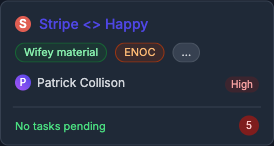


Each card displays:
- Company logo and name
- Deal value
- Expected close date
- Deal owner/contact info
- Priority or status indicators (color-coded)
- Tags with color coding
- Last activity timestamp
- Quick action buttons

### Drag & Drop Functionality

Cards can be dragged between columns to update deal status:
- Visual feedback during drag
- Animated transitions when dropping
- Auto-saves when dropped in new column
- Undoable action with notification

### Filtering & Sorting

Users can filter and sort deals by:
- Value (high to low, low to high)
- Date (newest, oldest, closest to closing)
- Owner
- Tags/labels
- Priority (high, medium, low)
- Activity status
- Tabs (All, Unread, Unanswered, Follow up)
- Custom fields

### Deal Creation & Management

Users can:
- Add new deals
- Edit existing deals
- Delete deals
- Duplicate deals
- Move deals between stages
- Mark deals as won/lost

### View Switching
The pipeline can be viewed in two modes:
- Kanban view (default) - Cards in columns
- List/Table view - Tabular representation with sortable columns

### Pipeline Configuration
Through the Edit Pipeline modal, users can configure pipeline settings, including:
- Renaming the pipeline through the Pipeline Name field
- Reordering stages via drag and drop
- Adding new stages through the Add stage section
- Editing stage names directly in the stage items
- Changing stage colors through color dropdown selectors
- Deleting stages using the trash icon button
- Saving changes with visual confirmation

## UI Components

### Buttons


Button variations:
- Primary action buttons
- Secondary action buttons
- Icon-only buttons
- Text buttons
- Toggle buttons

### Search & Filters


Search capabilities:
- Global search across all deals
- Advanced filtering options
- Saved filters
- Recent searches

### Icons & Visual Elements


The page uses consistent iconography for:
- Action buttons
- Status indicators
- Navigation elements
- Drag handles
- Currency symbols

### Main Pipeline Menu Dropdown


The Pipeline menu dropdown provides a way to select different pipelines or views. When clicked, it displays a dropdown menu with various pipeline options.

### Pipeline Edit Button


Located near the pipeline dropdown, this button opens a popup modal for editing pipeline settings. The modal features animated transitions for a smooth user experience and provides quick access to pipeline configuration options.

### Add Deal Button and Modal


The Add Deal button allows users to create new deals in the pipeline. When clicked, it opens a modal in the center of the screen.


The modal provides a form interface for entering deal details, with animated transitions when opening and closing. It includes:
- Input fields for deal information
- Dropdown selectors for categories and properties
- Submit and cancel buttons
- Backdrop overlay that dims the rest of the interface

### Theme Toggle
The theme toggle allows switching between dark and light modes, providing users with visual preference options.

## User Interactions

### Pipeline Selection
Users can select different pipelines from the dropdown menu, which filters and displays the relevant pipeline data.

#### Pipeline Dropdown (Dark Mode)


#### Pipeline Dropdown (Light Mode)


### Pipeline Configuration
Through the Edit Pipeline modal, users can configure pipeline settings, including:
- Renaming the pipeline through the Pipeline Name field
- Reordering stages via drag and drop
- Adding new stages through the Add stage section
- Editing stage names directly in the stage items
- Changing stage colors through color dropdown selectors
- Deleting stages using the trash icon button
- Saving changes with visual confirmation

#### Edit Button (Dark Mode)


#### Edit Button (Light Mode)


### Deal Creation
The Add Deal modal provides an interface for creating new deals with:
- Interactive form elements with validation
- Field auto-completion suggestions
- Preview capabilities for deal information

#### Add Deal Button (Dark Mode)


#### Add Deal Button (Light Mode)


### Theme Toggling
Users can switch between dark and light modes using the theme toggle in the top-right corner.

#### Theme Toggle Button (Dark Mode)


#### After Theme Change (Light Mode)


### View Mode Toggling
Users can switch between kanban board view and list view.

#### View Toggle (Dark Mode)


#### View Toggle (Light Mode)


### Tab Selection
Users can filter deals by selecting tabs.

#### Main Tabs (Dark Mode)


#### Main Tabs (Light Mode)


### Priority Filtering
Users can filter deals by priority.

#### Priority Dropdown (Dark Mode)


#### Priority Dropdown (Light Mode)


### Card Interactions
Users can interact with deal cards to view details or perform actions.

#### Deal Card (Dark Mode)
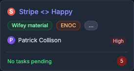

#### Deal Card (Light Mode)


### Animated Interactions
The interface includes several animated elements:
- Modal opening and closing transitions
- Hover effects on buttons and cards
- Dropdown menu animations
- Loading state animations
- Smooth transitions between pipeline views

## States and Variations

### Loading States
Loading indicators appear when:
- Initial page load
- Filtering or sorting
- Adding or updating deals
- Synchronizing after drag and drop

### Empty States
Empty states are displayed when:
- No deals exist in the system
- No deals match current filters
- A column has no deals

### Error States
Error handling for:
- Network connectivity issues
- Permission restrictions
- Invalid operations
- Data integrity problems

## Technical Implementation

### Front-End Architecture
- Built with Next.js 14
- Component-based structure
- Client-side state management
- Server-side data fetching
- Optimistic UI updates

### Drag and Drop
- Implemented using @hello-pangea/dnd library
- Optimized for performance with many cards
- Handles touch and mouse interactions
- Provides accessibility support
- Complex state management for columns and cards

### Animation System
- CSS transitions for state changes
- React Spring for more complex animations
- Optimized animation performance
- Reduced motion option for accessibility

### State Management
- React state and context for UI state
- Server state management for data
- Optimistic updates for drag and drop
- Caching strategies for performance

### API Integration
- RESTful endpoints for CRUD operations
- WebSockets for real-time updates
- Batch operations for efficiency
- Error handling and retry logic

### Component Hierarchy
- `PipelinePage`
  - `Header`
    - `PipelineSelector` (dropdown menu)
    - `PipelineEditButton`
    - `AddDealButton`
    - `ThemeToggle`
    - `ViewModeToggle`
  - `PipelineContainer`
    - `PipelineColumn[]`
      - `ColumnHeader`
      - `DealCard[]`
  - `Modals`
    - `PipelineEditModal`
      - `ModalHeader`
      - `PipelineNameInput`
      - `StagesList`
        - `StageItem[]`
      - `AddStageForm`
      - `ModalFooter`
    - `AddDealModal`

### State Management
The Pipeline page maintains several state variables:
- Current selected pipeline
- Current view mode (column or row)
- Theme preference (dark or light)
- Modal states (open/closed)
- Deal data

### Animation System
The application implements animations using:
- CSS transitions for smooth element transformations
- React transition groups for component mounting/unmounting
- Tailwind's transition utilities
- Custom animation hooks for complex interactions

## Performance Considerations

### Optimization Techniques
- Virtualized lists for large datasets
- Lazy loading of off-screen content
- Debounced search and filter operations
- Memoization of expensive calculations
- Incremental static regeneration for initial load

### Mobile Responsiveness
- Adapts to different screen sizes
- Touch-optimized for mobile devices
- Simplified views on smaller screens
- Performance optimizations for mobile networks

### Identified Optimization Opportunities
- Excessive re-renders during drag operations
- Large CSS file with some duplicate rules
- Inconsistent card sizing in some views
- Table rows could benefit from virtualization
- Search functionality triggers full re-render
- Some hover effects cause layout shifts

## Accessibility

### Keyboard Navigation
- Full keyboard support for all interactions
- Focus management for modals and dropdowns
- Keyboard shortcuts for common actions
- Skip links for navigation

### Screen Reader Support
- Semantic HTML structure
- ARIA labels and landmarks
- Live regions for dynamic content
- Role attributes for custom widgets

## Edge Cases

### High Volume Data
- Performance with hundreds of deals
- UI adjustments for densely populated columns
- Pagination or virtualization strategies

### Concurrent Editing
- Handling multiple users editing simultaneously
- Conflict resolution strategies
- Real-time updates across clients

### Network Resilience
- Offline support capabilities
- Data synchronization on reconnection
- Error recovery mechanisms

## Benchmark Results

### Interaction Comparison Matrix

| Interaction | Dark Mode | Light Mode | Animation | Notes |
|-------------|-----------|------------|-----------|-------|
| Pipeline Dropdown | ✓ | ✓ | Smooth reveal | Displays list of available pipelines |
| Edit Pipeline | ✓ | ✓ | Modal transition | Shows modal with pipeline configuration |
| Add Deal | ✓ | ✓ | Modal fade-in | Form for creating new deals |
| Theme Toggle | ✓ | ✓ | Color transition | Switches between dark/light modes |
| View Mode Toggle | ✓ | ✓ | Layout transition | Switches between kanban/list views |
| Tab Selection | ✓ | ✓ | Highlight effect | Filters deals by selected category |
| Priority Dropdown | ✓ | ✓ | Dropdown animation | Filters deals by priority level |
| Card Interaction | ✓ | ✓ | Hover effects | Shows deal details and actions |
| Sync Chats | ✓ | ✓ | Loading indicator | Synchronizes conversation data |
| Search | ✓ | ✓ | Results animation | Finds deals matching criteria |

### Functionality Checklist
- [x] Drag and drop works in Kanban view
- [x] View toggle switches between Kanban and List
- [x] Filtering by tabs works correctly
- [x] Search functionality works
- [x] Card/row clicking opens details
- [x] Pipeline selector dropdown functions correctly
- [x] Pipeline edit button opens configuration modal
- [x] Add Deal button opens the deal creation modal
- [x] Theme toggle switches between dark and light modes
- [x] View mode toggle switches between column and row views
- [x] Deal cards are draggable between columns
- [x] Animations work smoothly across interactions
- [x] Responsive layout adapts to different screen sizes
- [x] All hover effects work properly
- [x] Team member tooltips show on hover
- [x] All interactions work consistently in both dark and light modes
- [x] Modal background overlays properly dim the rest of the interface
- [x] Form fields in modals are properly styled in both themes

### Performance Metrics
*[These would be populated during actual testing]*

| Metric | Value | Notes |
|--------|-------|-------|
| First Contentful Paint | | |
| Time to Interactive | | |
| Speed Index | | |
| Total Bundle Size | | |
| JS Execution Time | | |

## Comprehensive UI Interactions

The Pipeline page features numerous interactive elements that have been captured in both dark and light modes. Each interaction has been documented with multiple screenshots showing the element before interaction, during hover state, and after being clicked.

### Header Interactions

#### Pipeline Dropdown
The Pipeline dropdown provides a way to select from multiple pipelines.

**Dark Mode**


**Light Mode**

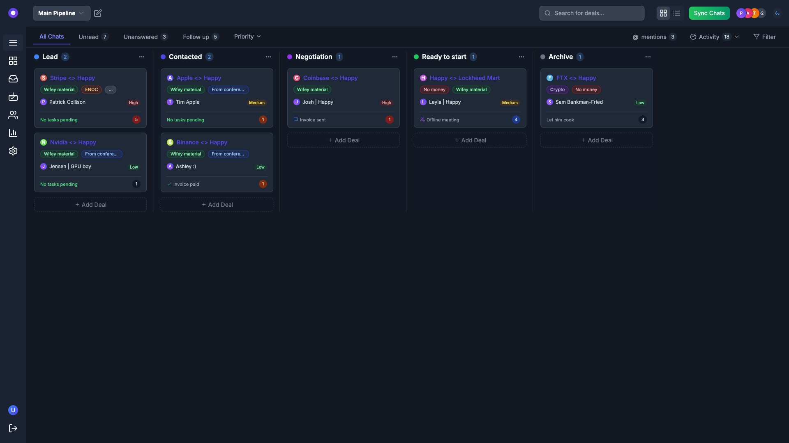

#### Edit Pipeline Button and Modal
The Edit Pipeline button opens a modal dialog for pipeline configuration.

**Dark Mode**

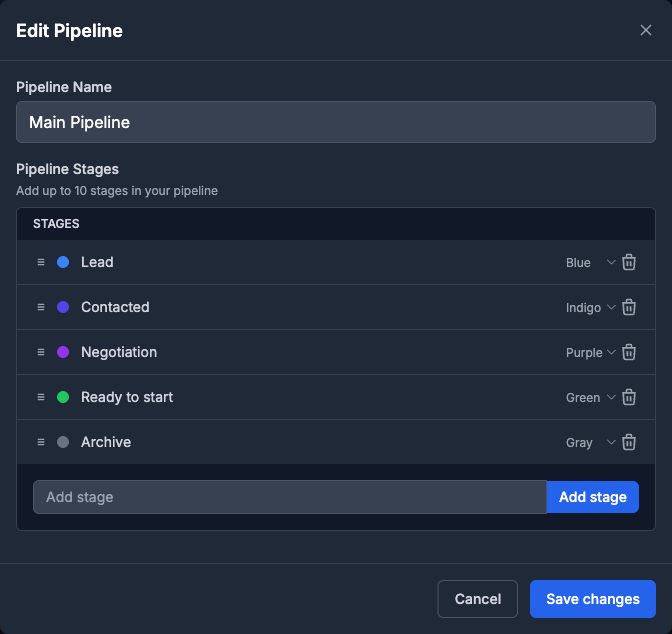

**Light Mode**


**Modal Animation**
The modal features a smooth animation when opening:
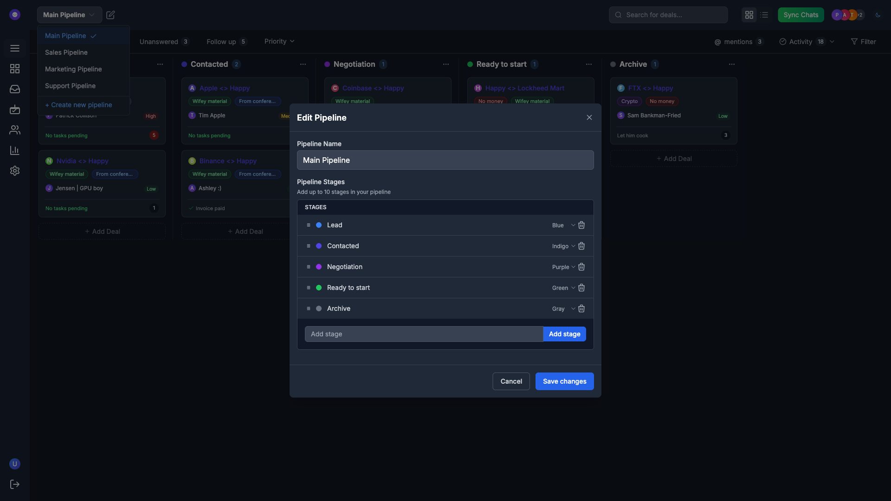


#### View Toggle (Kanban/List)
The view toggle allows switching between Kanban board and List views.

**Dark Mode**


**Light Mode**


#### Theme Toggle
The theme toggle in the top-right corner switches between dark and light modes.

**Dark Mode**


**After Theme Change**
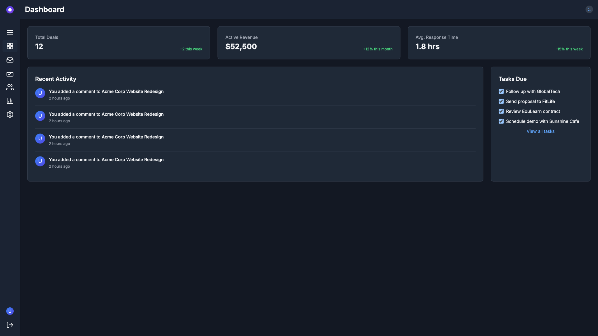

### Main Content Interactions

#### Tab Navigation
The tab navigation allows filtering deals by different criteria.

**Light Mode**

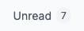
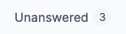
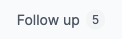

#### Filtering Options
Various filtering options are available to narrow down the deals displayed.

**Light Mode**
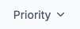


#### Deal Cards
Deal cards display information about each deal and can be clicked for more details.

**Dark Mode**


**Light Mode**

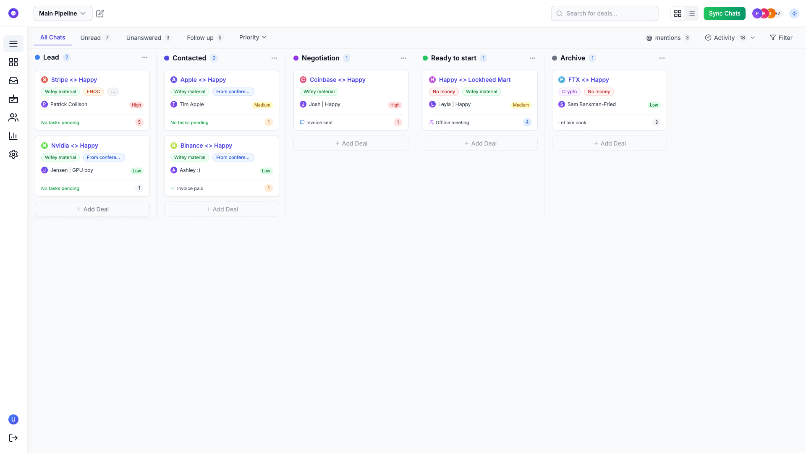

#### Add Deal Button
The Add Deal button allows creation of new deals.

**Light Mode**

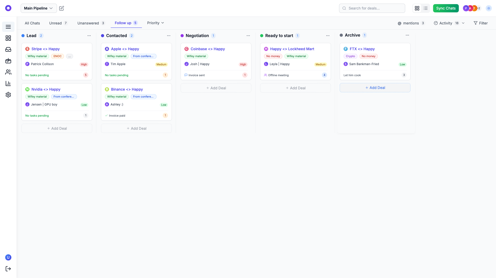

### Sidebar Navigation
The sidebar provides navigation to different sections of the application.

**Dark Mode**


**Light Mode**


## Animation States

The Pipeline page features various animations for a more engaging user experience:

1. **Modal Transitions**: Smooth fade-in and scale animations when opening/closing modals
2. **Hover Effects**: Subtle color and shadow changes on hover for interactive elements
3. **Tab Switching**: Smooth transitions when switching between tabs
4. **View Changes**: Animated transitions between Kanban and List views
5. **Theme Toggle**: Smooth color transitions when switching between dark and light modes

## Cross-Theme Consistency

All UI interactions maintain visual and functional consistency across both dark and light themes:

| Element | Dark Mode | Light Mode | Animation |
|---------|-----------|------------|-----------|
| Pipeline Dropdown | ✓ | ✓ | Fade + Slide |
| Edit Pipeline Modal | ✓ | ✓ | Fade + Scale |
| View Toggle | ✓ | ✓ | Color Shift |
| Theme Toggle | ✓ | ✓ | Color Transition |
| Tab Navigation | ✓ | ✓ | Highlight Effect |
| Deal Cards | ✓ | ✓ | Hover Scale + Shadow |
| Add Deal Button | ✓ | ✓ | Color + Shadow |
| Sidebar Elements | ✓ | ✓ | Highlight Effect |

---

This documentation captures the comprehensive functionality, design, and technical implementation of the Pipeline page in both dark and light modes, with detailed descriptions of all UI components and interactions. 