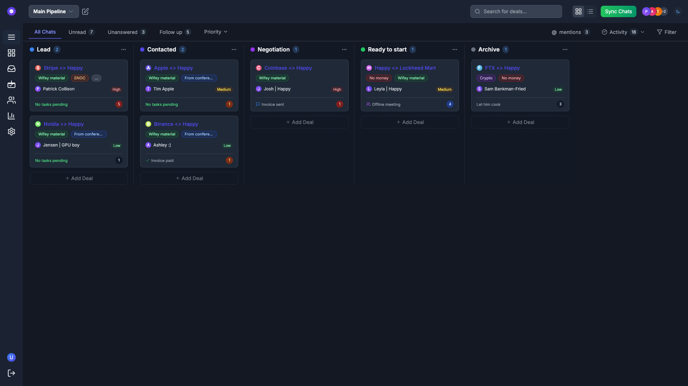
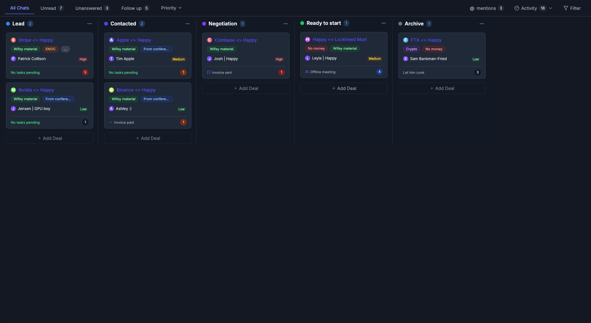

# Pipeline Page Documentation

## Overview

The pipeline page provides users with a kanban-style view to manage their sales pipeline and track deals through various stages.

## Screenshots

## Components

### Buttons 1.png (Light Mode)

### Buttons 2.png (Light Mode)

### Buttons 3.png (Light Mode)

### Card Dragging.png (Light Mode)

### Default View.png (Light Mode)

### Full.png (Light Mode)

### Header 1.png (Light Mode)

### Main Content 1.png (Light Mode)

### Sidebar Collapsed.png (Light Mode)

## Usage Guide

1. **Pipeline Selection**: Use the dropdown to switch between different pipelines
2. **View Toggle**: Switch between Kanban and List views
3. **Filters**: Filter deals by various criteria
4. **Deal Cards**: Drag and drop deals between pipeline stages
5. **Add Deal**: Create new deals directly from the pipeline view