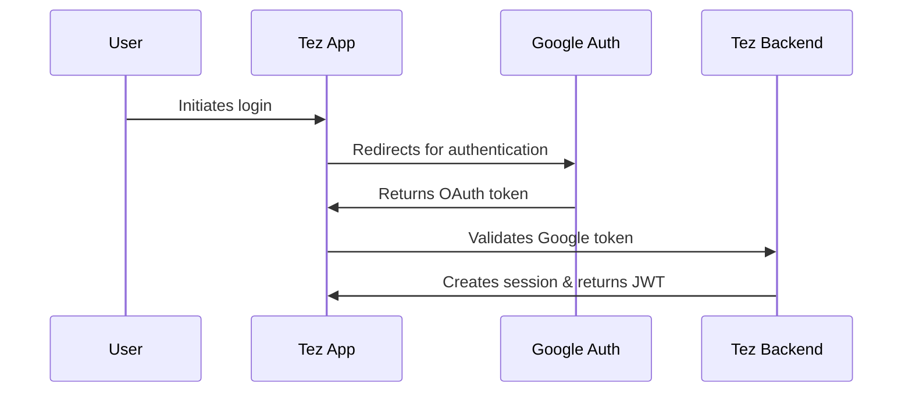
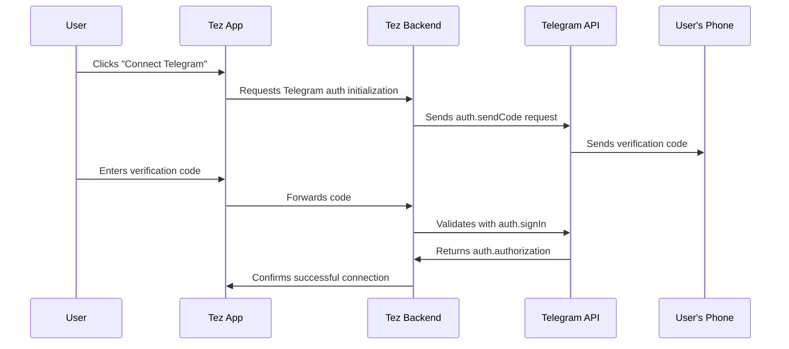

# Telegram Authentication Flow

## Overview

This document details the step-by-step process for authenticating users with Telegram while maintaining an active Google Sign-In session within the Tez CRM.

## Authentication Sequence

### 1. User Login via Google



### 2. Telegram Connection Process



## Detailed Implementation Steps

### Step 1: Initialize Telegram API Connection

```javascript
async function initializeTelegramAuth(apiId, apiHash) {
  try {
    const client = new TelegramClient({
      apiId: TELEGRAM_API_ID,
      apiHash: TELEGRAM_API_HASH,
      sessionStorage: new EncryptedSessionStorage(userKey)
    });
    
    await client.connect();
    return client;
  } catch (error) {
    console.error('Failed to initialize Telegram client:', error);
    throw new Error('Telegram connection failed');
  }
}
```

### Step 2: Request Phone Verification Code

```javascript
async function requestVerificationCode(client, phoneNumber) {
  try {
    const { phoneCodeHash } = await client.invoke(
      new Api.auth.SendCode({
        phoneNumber: phoneNumber,
        apiId: TELEGRAM_API_ID,
        apiHash: TELEGRAM_API_HASH,
        settings: new Api.CodeSettings({
          allowFlashCall: false,
          currentNumber: true,
          allowAppHash: true,
        })
      })
    );
    
    return { success: true, phoneCodeHash };
  } catch (error) {
    console.error('Failed to request verification code:', error);
    return { success: false, error: error.message };
  }
}
```

### Step 3: Verify Code and Sign In

```javascript
async function signInWithCode(client, phoneNumber, phoneCodeHash, verificationCode) {
  try {
    const authResult = await client.invoke(
      new Api.auth.SignIn({
        phoneNumber: phoneNumber,
        phoneCodeHash: phoneCodeHash,
        phoneCode: verificationCode
      })
    );
    
    return { success: true, user: authResult.user };
  } catch (error) {
    if (error.errorMessage === 'SESSION_PASSWORD_NEEDED') {
      return { success: false, requiresPassword: true };
    }
    
    console.error('Failed to sign in with code:', error);
    return { success: false, error: error.message };
  }
}
```

### Step 4: Handle 2FA if Required

```javascript
async function handle2FA(client, password) {
  try {
    const passwordInfo = await client.invoke(new Api.account.GetPassword());
    const passwordSRP = await calculatePasswordSRP(passwordInfo, password);
    
    const authResult = await client.invoke(
      new Api.auth.CheckPassword({
        password: passwordSRP
      })
    );
    
    return { success: true, user: authResult.user };
  } catch (error) {
    console.error('Failed to complete 2FA:', error);
    return { success: false, error: error.message };
  }
}
```

### Step 5: Store Authentication Data

```javascript
async function storeAuthSession(userId, sessionData) {
  try {
    // Encrypt session data before storing
    const encryptedSession = encryptData(sessionData, process.env.ENCRYPTION_KEY);
    
    await database.telegramSessions.upsert({
      userId: userId,
      sessionData: encryptedSession,
      connectedAt: new Date()
    });
    
    return { success: true };
  } catch (error) {
    console.error('Failed to store authentication session:', error);
    return { success: false, error: error.message };
  }
}
```

## Frontend Implementation

### Connection Modal Component

```jsx
function TelegramConnectModal({ isOpen, onClose, onSuccess }) {
  const [step, setStep] = useState('phone');
  const [phoneNumber, setPhoneNumber] = useState('');
  const [verificationCode, setVerificationCode] = useState('');
  const [password, setPassword] = useState('');
  const [phoneCodeHash, setPhoneCodeHash] = useState(null);
  const [loading, setLoading] = useState(false);
  const [error, setError] = useState(null);

  const handlePhoneSubmit = async () => {
    setLoading(true);
    setError(null);
    
    try {
      const response = await api.post('/telegram/request-code', { phoneNumber });
      
      if (response.data.success) {
        setPhoneCodeHash(response.data.phoneCodeHash);
        setStep('verification');
      } else {
        setError(response.data.error || 'Failed to send verification code');
      }
    } catch (err) {
      setError('Network error occurred');
      console.error(err);
    } finally {
      setLoading(false);
    }
  };

  const handleVerificationSubmit = async () => {
    // Implementation for verification code submission...
  };

  const handle2FASubmit = async () => {
    // Implementation for 2FA password submission...
  };

  // Render different steps based on current authentication step
  // ...
}
```

## Security Considerations

1. **Token Storage**: Securely store Telegram session tokens using encrypted storage
2. **Session Validation**: Regularly validate stored sessions to ensure they remain valid
3. **Revocation Process**: Implement a clear process for users to revoke Telegram access
4. **Rate Limiting**: Implement rate limiting to prevent abuse of the authentication flow
5. **Audit Logging**: Log all authentication attempts with appropriate details for security analysis

## Error Handling

| Error Code | Description | Resolution |
|------------|-------------|------------|
| PHONE_NUMBER_INVALID | Invalid phone number format | Prompt user to check number format |
| PHONE_CODE_INVALID | Incorrect verification code | Allow user to request new code |
| PHONE_CODE_EXPIRED | Verification code has expired | Restart auth process |
| PASSWORD_HASH_INVALID | Incorrect 2FA password | Provide password hint if available |
| API_ID_INVALID | API credentials issue | Contact support to fix API credentials |

## Testing the Authentication Flow

1. Create test Telegram accounts for development
2. Implement mock responses for each authentication step
3. Test edge cases:
   - Phone number formatting variations
   - Expired verification codes
   - 2FA requirements
   - Session revocation

## User Experience Recommendations

1. Clearly explain why Telegram connection is needed
2. Provide visual feedback during each authentication step
3. Allow users to cancel the process at any point
4. Give clear instructions for entering phone number in international format
5. Offer reconnection option if authentication fails 