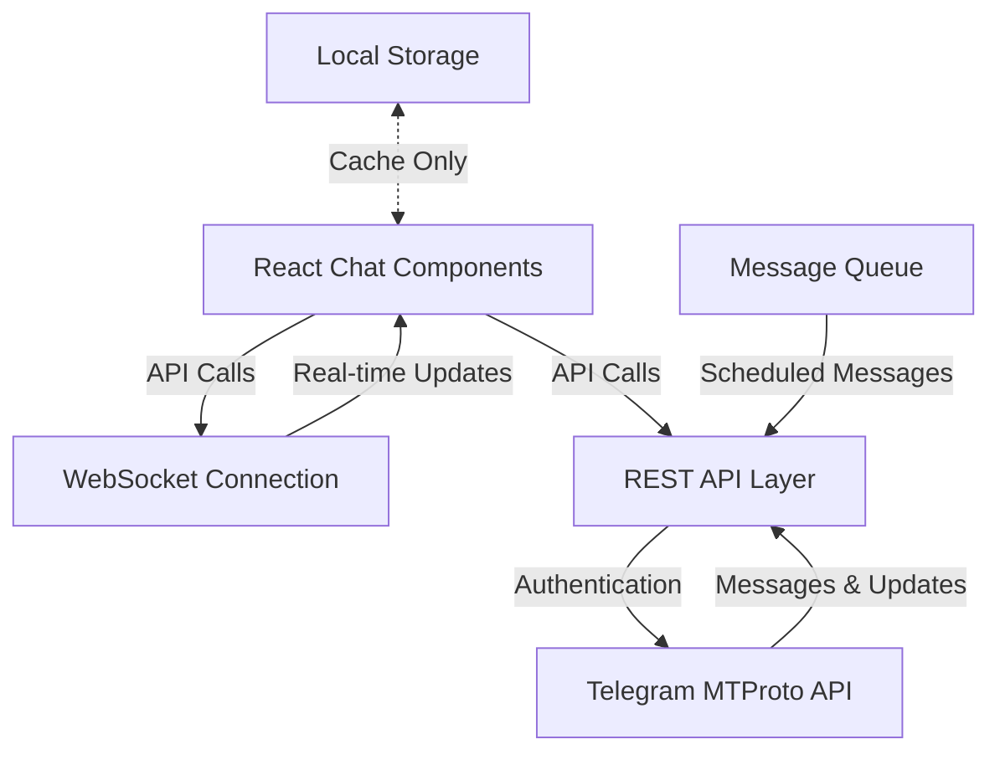

# Custom Telegram Chat Window Implementation

## Overview

This document details the implementation of a custom Telegram chat window within the Tez CRM platform. The chat window provides a seamless, native-like Telegram messaging experience while being fully integrated with the CRM's pipeline and deal management capabilities.

## Key Features

1. **Real-time Message Synchronization**: Immediate display of sent and received messages
2. **Ephemeral Message Fetching**: Retrieving messages without persistent storage
3. **Message Forwarding**: Ability to forward messages between chats
4. **Scheduled Messages**: Scheduling messages for future delivery
5. **Rich Media Support**: Full support for photos, videos, voice messages, and files
6. **Reaction Support**: Ability to react to messages with emojis
7. **Message Editing**: Edit sent messages within the allowed timeframe
8. **Message Threading**: Support for reply threads and conversation context
9. **Typing Indicators**: Real-time typing indicators for both parties
10. **Read Receipts**: Visual indicators for message delivery and read status

## Architecture



## API Requirements

### 1. Message Retrieval API

#### `GET /api/telegram/messages/:chatId`

Fetches messages for a specific chat without permanent storage in the CRM database.

**Query Parameters:**
- `limit`: Number of messages to retrieve (default: 50)
- `offset`: Message ID to start from (for pagination)
- `ephemeral`: Boolean indicating whether to store messages (default: true)

**Response:**
```json
{
  "messages": [
    {
      "id": "12345",
      "text": "Message content",
      "from": {
        "id": "67890",
        "firstName": "John",
        "lastName": "Doe"
      },
      "date": "2023-07-15T14:30:00Z",
      "replyToMessageId": null,
      "media": null,
      "forward": null,
      "reactions": []
    }
  ],
  "hasMore": true,
  "totalCount": 235
}
```

### 2. Send Message API

#### `POST /api/telegram/messages/send`

Sends a message to a Telegram chat.

**Request Body:**
```json
{
  "chatId": "67890",
  "text": "Message content",
  "replyToMessageId": null,
  "media": null,
  "scheduledFor": null,
  "silentMode": false,
  "clearDraft": true
}
```

**Response:**
```json
{
  "success": true,
  "message": {
    "id": "12346",
    "text": "Message content",
    "date": "2023-07-15T14:31:00Z",
    "status": "sent"
  }
}
```

### 3. Forward Message API

#### `POST /api/telegram/messages/forward`

Forwards a message to another chat.

**Request Body:**
```json
{
  "messageId": "12345",
  "fromChatId": "67890",
  "toChatId": "54321",
  "hideCaption": false,
  "hideSender": false,
  "scheduledFor": null
}
```

**Response:**
```json
{
  "success": true,
  "message": {
    "id": "34567",
    "forwardedFrom": {
      "chatId": "67890",
      "messageId": "12345",
      "senderName": "John Doe"
    },
    "date": "2023-07-15T14:35:00Z",
    "status": "sent"
  }
}
```

### 4. Schedule Message API

#### `POST /api/telegram/messages/schedule`

Schedules a message for future delivery.

**Request Body:**
```json
{
  "chatId": "67890",
  "text": "Scheduled message content",
  "scheduledFor": "2023-07-16T10:00:00Z",
  "media": null,
  "replyToMessageId": null,
  "silentMode": false
}
```

**Response:**
```json
{
  "success": true,
  "scheduledMessage": {
    "id": "sched_12345",
    "text": "Scheduled message content",
    "scheduledFor": "2023-07-16T10:00:00Z",
    "status": "scheduled"
  }
}
```

### 5. Edit Message API

#### `PATCH /api/telegram/messages/:messageId`

Edits a previously sent message.

**Request Body:**
```json
{
  "chatId": "67890",
  "text": "Updated message content",
  "media": null
}
```

**Response:**
```json
{
  "success": true,
  "message": {
    "id": "12345",
    "text": "Updated message content",
    "editedAt": "2023-07-15T14:40:00Z",
    "status": "edited"
  }
}
```

### 6. Delete Message API

#### `DELETE /api/telegram/messages/:messageId`

Deletes a message from the chat.

**Query Parameters:**
- `chatId`: ID of the chat containing the message
- `deleteForEveryone`: Boolean indicating whether to delete for all users

**Response:**
```json
{
  "success": true,
  "deletedMessageId": "12345"
}
```

### 7. React to Message API

#### `POST /api/telegram/messages/:messageId/react`

Adds a reaction to a message.

**Request Body:**
```json
{
  "chatId": "67890",
  "reaction": "👍",
  "big": false
}
```

**Response:**
```json
{
  "success": true,
  "reaction": {
    "messageId": "12345",
    "reaction": "👍",
    "count": 1,
    "recent": [
      {
        "userId": "user123",
        "name": "John Doe"
      }
    ]
  }
}
```

### 8. Message Status Updates API

#### `GET /api/telegram/messages/:messageId/status`

Gets the current status of a message (sent, delivered, read).

**Query Parameters:**
- `chatId`: ID of the chat containing the message

**Response:**
```json
{
  "messageId": "12345",
  "status": "read",
  "deliveredAt": "2023-07-15T14:31:05Z",
  "readAt": "2023-07-15T14:32:00Z",
  "readBy": [
    {
      "userId": "user456",
      "name": "Jane Smith",
      "readAt": "2023-07-15T14:32:00Z"
    }
  ]
}
```

## WebSocket Implementation

The chat window requires a WebSocket connection for real-time updates, including:
- New incoming messages
- Status updates (delivered, read)
- Typing indicators
- Online/offline status changes
- Message reactions

### WebSocket Message Types

1. **New Message**
```json
{
  "type": "new_message",
  "chatId": "67890",
  "message": {
    "id": "12348",
    "text": "New incoming message",
    "from": {
      "id": "user456",
      "firstName": "Jane",
      "lastName": "Smith"
    },
    "date": "2023-07-15T14:45:00Z"
  }
}
```

2. **Status Update**
```json
{
  "type": "status_update",
  "chatId": "67890",
  "messageId": "12345",
  "status": "read",
  "updatedAt": "2023-07-15T14:46:00Z"
}
```

3. **Typing Indicator**
```json
{
  "type": "typing",
  "chatId": "67890",
  "user": {
    "id": "user456",
    "firstName": "Jane",
    "lastName": "Smith"
  },
  "action": "typing"
}
```

4. **Online Status**
```json
{
  "type": "online_status",
  "userId": "user456",
  "status": "online",
  "lastSeen": null
}
```

5. **Reaction Update**
```json
{
  "type": "reaction_update",
  "chatId": "67890",
  "messageId": "12345",
  "reactions": [
    {
      "emoji": "👍",
      "count": 2,
      "recentUsers": ["user123", "user456"]
    }
  ]
}
```

## Client-Side Implementation

### React Component Structure

```
ChatWindow/
├── ChatHeader/
│   ├── ChatInfo.jsx
│   ├── ChatActions.jsx
│   └── OnlineStatus.jsx
├── MessageList/
│   ├── MessageListContainer.jsx
│   ├── Message/
│   │   ├── TextMessage.jsx
│   │   ├── MediaMessage.jsx
│   │   ├── ForwardedMessage.jsx
│   │   ├── ReplyComponent.jsx
│   │   └── Reactions.jsx
│   └── DateSeparator.jsx
├── InputArea/
│   ├── MessageInput.jsx
│   ├── AttachmentButton.jsx
│   ├── EmojiPicker.jsx
│   ├── VoiceRecorder.jsx
│   └── ScheduleOptions.jsx
└── ChatWindowContainer.jsx
```

### Key Client-Side Functionalities

#### 1. Ephemeral Message Management

```javascript
function useChatMessages(chatId, initialLimit = 50) {
  const [messages, setMessages] = useState([]);
  const [loading, setLoading] = useState(true);
  const [hasMore, setHasMore] = useState(true);
  
  const fetchMessages = useCallback(async (offset = null) => {
    setLoading(true);
    try {
      const response = await api.get(`/api/telegram/messages/${chatId}`, {
        params: {
          limit: initialLimit,
          offset,
          ephemeral: true
        }
      });
      
      if (offset) {
        setMessages(prev => [...response.data.messages, ...prev]);
      } else {
        setMessages(response.data.messages);
      }
      
      setHasMore(response.data.hasMore);
    } catch (error) {
      console.error('Failed to fetch messages:', error);
    } finally {
      setLoading(false);
    }
  }, [chatId, initialLimit]);
  
  useEffect(() => {
    fetchMessages();
    
    // Setup WebSocket connection for real-time updates
    const socket = getWebSocketConnection();
    
    socket.on(`chat:${chatId}:new_message`, (message) => {
      setMessages(prev => [...prev, message]);
    });
    
    return () => {
      socket.off(`chat:${chatId}:new_message`);
    };
  }, [chatId, fetchMessages]);
  
  const loadMoreMessages = () => {
    if (!messages.length || !hasMore || loading) return;
    
    const oldestMessageId = messages[0].id;
    fetchMessages(oldestMessageId);
  };
  
  return { messages, loading, hasMore, loadMoreMessages };
}
```

#### 2. Message Sending with Scheduling

```javascript
function useSendMessage(chatId) {
  const [sending, setSending] = useState(false);
  
  const sendMessage = async (text, options = {}) => {
    const {
      replyToMessageId = null,
      media = null,
      scheduledFor = null,
      silentMode = false,
      clearDraft = true
    } = options;
    
    setSending(true);
    
    try {
      const response = await api.post('/api/telegram/messages/send', {
        chatId,
        text,
        replyToMessageId,
        media,
        scheduledFor,
        silentMode,
        clearDraft
      });
      
      setSending(false);
      return response.data;
    } catch (error) {
      console.error('Failed to send message:', error);
      setSending(false);
      throw error;
    }
  };
  
  const scheduleMessage = async (text, scheduledTime, options = {}) => {
    return sendMessage(text, { ...options, scheduledFor: scheduledTime });
  };
  
  return { sendMessage, scheduleMessage, sending };
}
```

#### 3. Forwarding Messages

```javascript
function useForwardMessage() {
  const [forwarding, setForwarding] = useState(false);
  
  const forwardMessage = async (messageId, fromChatId, toChatId, options = {}) => {
    const {
      hideCaption = false,
      hideSender = false,
      scheduledFor = null
    } = options;
    
    setForwarding(true);
    
    try {
      const response = await api.post('/api/telegram/messages/forward', {
        messageId,
        fromChatId,
        toChatId,
        hideCaption,
        hideSender,
        scheduledFor
      });
      
      setForwarding(false);
      return response.data;
    } catch (error) {
      console.error('Failed to forward message:', error);
      setForwarding(false);
      throw error;
    }
  };
  
  return { forwardMessage, forwarding };
}
```

## Optimizations for Fast Performance

### 1. Virtualized Message List

```jsx
import { FixedSizeList as List } from 'react-window';
import InfiniteLoader from 'react-window-infinite-loader';

function VirtualizedMessageList({ messages, loadMoreMessages, hasMore, isItemLoaded, height, width }) {
  const itemCount = hasMore ? messages.length + 1 : messages.length;
  
  const Item = ({ index, style }) => {
    if (!isItemLoaded(index) && hasMore) {
      return <div style={style}>Loading...</div>;
    }
    
    if (index >= messages.length) {
      return null;
    }
    
    const message = messages[index];
    
    return (
      <div style={style}>
        <Message message={message} />
      </div>
    );
  };
  
  return (
    <InfiniteLoader
      isItemLoaded={isItemLoaded}
      itemCount={itemCount}
      loadMoreItems={loadMoreMessages}
    >
      {({ onItemsRendered, ref }) => (
        <List
          ref={ref}
          height={height}
          width={width}
          itemCount={itemCount}
          itemSize={80} // Adjust based on average message height
          onItemsRendered={onItemsRendered}
        >
          {Item}
        </List>
      )}
    </InfiniteLoader>
  );
}
```

### 2. Message Caching Strategy

```javascript
// Configure message cache with time-based expiration
const messageCache = new LRUCache({
  max: 1000, // Store up to 1000 messages
  ttl: 1000 * 60 * 30, // Cache for 30 minutes
  updateAgeOnGet: true // Reset TTL when accessed
});

// Cache middleware for API requests
function cacheMiddleware(req, res, next) {
  const cacheKey = `${req.method}:${req.originalUrl}`;
  
  // Only cache GET requests for messages
  if (req.method === 'GET' && req.path.includes('/messages/')) {
    const cachedResponse = messageCache.get(cacheKey);
    
    if (cachedResponse) {
      return res.json(cachedResponse);
    }
    
    // Store original send function
    const originalSend = res.send;
    
    // Override send function to cache response
    res.send = function(body) {
      messageCache.set(cacheKey, JSON.parse(body));
      originalSend.call(this, body);
    };
  }
  
  next();
}
```

### 3. WebSocket Connection Management

```javascript
class WebSocketManager {
  constructor(baseUrl) {
    this.baseUrl = baseUrl;
    this.socket = null;
    this.reconnectAttempts = 0;
    this.maxReconnectAttempts = 5;
    this.reconnectDelay = 1000;
    this.subscriptions = new Map();
  }
  
  connect(token) {
    return new Promise((resolve, reject) => {
      this.socket = new WebSocket(`${this.baseUrl}?token=${token}`);
      
      this.socket.onopen = () => {
        console.log('WebSocket connected');
        this.reconnectAttempts = 0;
        this.reconnectDelay = 1000;
        resolve(this.socket);
      };
      
      this.socket.onclose = (event) => {
        console.log('WebSocket disconnected', event);
        this.attemptReconnect();
      };
      
      this.socket.onerror = (error) => {
        console.error('WebSocket error:', error);
        reject(error);
      };
      
      this.socket.onmessage = (event) => {
        try {
          const data = JSON.parse(event.data);
          
          if (data.type && data.chatId) {
            const key = `chat:${data.chatId}:${data.type}`;
            
            if (this.subscriptions.has(key)) {
              this.subscriptions.get(key).forEach(callback => callback(data));
            }
          }
        } catch (error) {
          console.error('Error processing WebSocket message:', error);
        }
      };
    });
  }
  
  attemptReconnect() {
    if (this.reconnectAttempts < this.maxReconnectAttempts) {
      this.reconnectAttempts++;
      
      setTimeout(() => {
        console.log(`Attempting to reconnect (${this.reconnectAttempts}/${this.maxReconnectAttempts})...`);
        this.connect();
      }, this.reconnectDelay);
      
      // Exponential backoff
      this.reconnectDelay *= 2;
    } else {
      console.error('Maximum reconnection attempts reached');
    }
  }
  
  subscribe(chatId, eventType, callback) {
    const key = `chat:${chatId}:${eventType}`;
    
    if (!this.subscriptions.has(key)) {
      this.subscriptions.set(key, []);
    }
    
    this.subscriptions.get(key).push(callback);
    
    return () => {
      const callbacks = this.subscriptions.get(key);
      const index = callbacks.indexOf(callback);
      
      if (index !== -1) {
        callbacks.splice(index, 1);
      }
    };
  }
  
  disconnect() {
    if (this.socket) {
      this.socket.close();
      this.socket = null;
      this.subscriptions.clear();
    }
  }
}
```

## Integration with CRM Features

### 1. Pipeline Association

```javascript
function useChatPipelineAssociation(chatId) {
  const [associatedDeals, setAssociatedDeals] = useState([]);
  const [loading, setLoading] = useState(true);
  
  useEffect(() => {
    const fetchAssociatedDeals = async () => {
      setLoading(true);
      try {
        const response = await api.get(`/api/deals/by-chat/${chatId}`);
        setAssociatedDeals(response.data.deals);
      } catch (error) {
        console.error('Failed to fetch associated deals:', error);
      } finally {
        setLoading(false);
      }
    };
    
    fetchAssociatedDeals();
  }, [chatId]);
  
  const associateDeal = async (dealId) => {
    try {
      const response = await api.post('/api/deals/associate-chat', {
        dealId,
        chatId
      });
      
      if (response.data.success) {
        setAssociatedDeals(prev => [...prev, response.data.deal]);
      }
      
      return response.data;
    } catch (error) {
      console.error('Failed to associate deal:', error);
      throw error;
    }
  };
  
  return { associatedDeals, loading, associateDeal };
}
```

### 2. Contact Information Panel

```jsx
function ContactInfoPanel({ contactId }) {
  const [contact, setContact] = useState(null);
  const [loading, setLoading] = useState(true);
  
  useEffect(() => {
    const fetchContactDetails = async () => {
      setLoading(true);
      try {
        const response = await api.get(`/api/contacts/${contactId}`);
        setContact(response.data);
      } catch (error) {
        console.error('Failed to fetch contact details:', error);
      } finally {
        setLoading(false);
      }
    };
    
    fetchContactDetails();
  }, [contactId]);
  
  if (loading) {
    return <div>Loading contact information...</div>;
  }
  
  if (!contact) {
    return <div>Contact not found</div>;
  }
  
  return (
    <div className="contact-info-panel">
      <div className="contact-header">
        
        <h3>{contact.firstName} {contact.lastName}</h3>
        
        {contact.telegramUsername && (
          <span className="username">@{contact.telegramUsername}</span>
        )}
        
        {contact.telegramLastSeen && (
          <span className="last-seen">
            Last seen: {formatDate(contact.telegramLastSeen)}
          </span>
        )}
      </div>
      
      <div className="contact-details">
        {contact.phoneNumber && (
          <div className="detail-item">
            <span className="icon">📱</span>
            <span>{contact.phoneNumber}</span>
          </div>
        )}
        
        {contact.email && (
          <div className="detail-item">
            <span className="icon">✉️</span>
            <span>{contact.email}</span>
          </div>
        )}
        
        {contact.telegramBio && (
          <div className="bio">
            <h4>Bio</h4>
            <p>{contact.telegramBio}</p>
          </div>
        )}
      </div>
      
      <div className="crm-details">
        <h4>CRM Information</h4>
        
        <div className="detail-item">
          <span className="label">Status:</span>
          <span className="value">{contact.status}</span>
        </div>
        
        <div className="detail-item">
          <span className="label">Added on:</span>
          <span className="value">{formatDate(contact.createdAt)}</span>
        </div>
        
        <div className="detail-item">
          <span className="label">Last contact:</span>
          <span className="value">{formatDate(contact.lastContactedAt)}</span>
        </div>
      </div>
      
      <div className="actions">
        <button className="action-button">Create Deal</button>
        <button className="action-button">Add Task</button>
        <button className="action-button">View in CRM</button>
      </div>
    </div>
  );
}
```

## Performance Benchmarks

For optimal user experience, the chat window should meet the following performance targets:

| Metric | Target | Description |
|--------|--------|-------------|
| Initial Load Time | < 1.5s | Time to load initial chat interface |
| Message Load Time | < 500ms | Time to load a batch of 50 messages |
| Send Message Latency | < 300ms | Time from send to confirmation |
| Scroll Performance | 60fps | Framerate during chat scrolling |
| Memory Usage | < 100MB | Browser memory consumption |
| WebSocket Reconnect | < 3s | Time to reconnect after disconnect |

## Error Handling

### Common Error Scenarios

1. **Authentication Failures**
```javascript
function handleAuthenticationError(error) {
  if (error.response && error.response.status === 401) {
    // Clear session storage
    sessionStorage.removeItem('telegram_session');
    
    // Redirect to authentication page
    window.location.href = '/telegram/connect';
    
    return { handled: true };
  }
  
  return { handled: false };
}
```

2. **Network Issues**
```javascript
function handleNetworkError(error, retryCallback) {
  if (!navigator.onLine || error.message === 'Network Error') {
    toast.error('Network connection lost. Retrying when online...');
    
    const handleOnline = () => {
      toast.success('Network connection restored');
      retryCallback();
      window.removeEventListener('online', handleOnline);
    };
    
    window.addEventListener('online', handleOnline);
    
    return { handled: true };
  }
  
  return { handled: false };
}
```

3. **Rate Limiting**
```javascript
function handleRateLimitError(error, retryCallback) {
  if (error.response && error.response.status === 429) {
    const retryAfter = parseInt(error.response.headers['retry-after']) || 30;
    
    toast.warning(`Rate limit exceeded. Retrying in ${retryAfter} seconds...`);
    
    setTimeout(() => {
      retryCallback();
    }, retryAfter * 1000);
    
    return { handled: true };
  }
  
  return { handled: false };
}
```

## Testing Strategy

### Unit Tests

1. **Message Rendering Tests**
```javascript
describe('Message Component', () => {
  test('renders text message correctly', () => {
    const message = {
      id: '123',
      text: 'Hello world',
      from: { id: 'user1', firstName: 'John' },
      date: new Date().toISOString(),
    };
    
    const { getByText } = render(<Message message={message} />);
    
    expect(getByText('Hello world')).toBeInTheDocument();
    expect(getByText('John')).toBeInTheDocument();
  });
  
  test('renders forwarded message correctly', () => {
    const message = {
      id: '124',
      text: 'Forwarded content',
      from: { id: 'user1', firstName: 'John' },
      forwardedFrom: { name: 'Jane' },
      date: new Date().toISOString(),
    };
    
    const { getByText } = render(<Message message={message} />);
    
    expect(getByText('Forwarded content')).toBeInTheDocument();
    expect(getByText('Forwarded from Jane')).toBeInTheDocument();
  });
});
```

2. **Hook Tests**
```javascript
describe('useSendMessage hook', () => {
  beforeEach(() => {
    jest.spyOn(api, 'post').mockImplementation(() => 
      Promise.resolve({ data: { success: true, message: { id: '123' } } })
    );
  });
  
  test('sends message correctly', async () => {
    const { result } = renderHook(() => useSendMessage('chat123'));
    
    const response = await act(() => result.current.sendMessage('Test message'));
    
    expect(api.post).toHaveBeenCalledWith('/api/telegram/messages/send', {
      chatId: 'chat123',
      text: 'Test message',
      replyToMessageId: null,
      media: null,
      scheduledFor: null,
      silentMode: false,
      clearDraft: true
    });
    
    expect(response).toEqual({ success: true, message: { id: '123' } });
  });
  
  test('schedules message correctly', async () => {
    const { result } = renderHook(() => useSendMessage('chat123'));
    const scheduledTime = new Date(Date.now() + 3600000).toISOString();
    
    await act(() => result.current.scheduleMessage('Scheduled message', scheduledTime));
    
    expect(api.post).toHaveBeenCalledWith('/api/telegram/messages/send', {
      chatId: 'chat123',
      text: 'Scheduled message',
      replyToMessageId: null,
      media: null,
      scheduledFor: scheduledTime,
      silentMode: false,
      clearDraft: true
    });
  });
});
```

### Integration Tests

1. **Message Flow Tests**
```javascript
describe('Message Flow', () => {
  test('sends and receives messages', async () => {
    // Mock WebSocket
    const mockSocket = {
      send: jest.fn(),
      addEventListener: jest.fn(),
      removeEventListener: jest.fn()
    };
    
    jest.spyOn(window, 'WebSocket').mockImplementation(() => mockSocket);
    
    // Render chat window
    const { getByTestId, findByText } = render(<ChatWindow chatId="chat123" />);
    
    // Type and send message
    const input = getByTestId('message-input');
    fireEvent.change(input, { target: { value: 'Test message' } });
    fireEvent.click(getByTestId('send-button'));
    
    // Verify API call
    await waitFor(() => {
      expect(api.post).toHaveBeenCalledWith('/api/telegram/messages/send', 
        expect.objectContaining({ text: 'Test message', chatId: 'chat123' })
      );
    });
    
    // Simulate incoming message via WebSocket
    const mockMessageEvent = {
      data: JSON.stringify({
        type: 'new_message',
        chatId: 'chat123',
        message: {
          id: '456',
          text: 'Response to test',
          from: { id: 'user2', firstName: 'Jane' },
          date: new Date().toISOString()
        }
      })
    };
    
    // Find the WebSocket onmessage handler and call it with our mock event
    const onMessageHandler = mockSocket.addEventListener.mock.calls.find(
      call => call[0] === 'message'
    )[1];
    
    act(() => {
      onMessageHandler(mockMessageEvent);
    });
    
    // Verify message appears in the chat
    const responseMessage = await findByText('Response to test');
    expect(responseMessage).toBeInTheDocument();
  });
});
```

## Accessibility Considerations

1. **Keyboard Navigation**
```jsx
function MessageActionMenu({ message, onReply, onForward, onEdit, onDelete }) {
  const [isOpen, setIsOpen] = useState(false);
  const menuRef = useRef(null);
  
  useEffect(() => {
    const handleKeyDown = (e) => {
      if (isOpen) {
        switch (e.key) {
          case 'Escape':
            setIsOpen(false);
            break;
          case 'ArrowDown':
            e.preventDefault();
            focusNextItem();
            break;
          case 'ArrowUp':
            e.preventDefault();
            focusPreviousItem();
            break;
          case 'Enter':
          case ' ':
            e.preventDefault();
            activateCurrentItem();
            break;
          default:
            break;
        }
      }
    };
    
    if (isOpen) {
      document.addEventListener('keydown', handleKeyDown);
    }
    
    return () => {
      document.removeEventListener('keydown', handleKeyDown);
    };
  }, [isOpen]);
  
  // Implementation details for focus management...
  
  return (
    <div className="message-action-menu">
      <button 
        aria-haspopup="true"
        aria-expanded={isOpen}
        onClick={() => setIsOpen(!isOpen)}
      >
        •••
      </button>
      
      {isOpen && (
        <ul 
          role="menu" 
          ref={menuRef}
          aria-label="Message actions"
        >
          <li role="menuitem" tabIndex={0} onClick={onReply}>Reply</li>
          <li role="menuitem" tabIndex={0} onClick={onForward}>Forward</li>
          {message.canEdit && (
            <li role="menuitem" tabIndex={0} onClick={onEdit}>Edit</li>
          )}
          <li role="menuitem" tabIndex={0} onClick={onDelete}>Delete</li>
        </ul>
      )}
    </div>
  );
}
```

2. **Screen Reader Support**
```jsx
function Message({ message }) {
  const messageTime = formatTime(new Date(message.date));
  const senderName = `${message.from.firstName} ${message.from.lastName || ''}`.trim();
  
  return (
    <div 
      className={`message ${message.from.id === currentUserId ? 'outgoing' : 'incoming'}`}
      aria-label={`${senderName} at ${messageTime}`}
    >
      <div className="message-sender" aria-hidden={message.from.id === currentUserId}>
        {senderName}
      </div>
      
      <div className="message-content">
        {message.forwardedFrom && (
          <div 
            className="forwarded-label"
            aria-label={`Forwarded from ${message.forwardedFrom.name}`}
          >
            Forwarded from {message.forwardedFrom.name}
          </div>
        )}
        
        <div className="message-text">{message.text}</div>
        
        {message.media && (
          <div className="message-media">
            {/* Media rendering with appropriate alt text */}
            {message.media.type === 'photo' && (
              
            )}
          </div>
        )}
        
        <div className="message-time" aria-hidden="true">
          {messageTime}
        </div>
      </div>
    </div>
  );
}
```

## Security Considerations

1. **Secure API Communication**
```javascript
// Ensure JWT token is sent with all API requests
api.interceptors.request.use(config => {
  const token = sessionStorage.getItem('auth_token');
  
  if (token) {
    config.headers.Authorization = `Bearer ${token}`;
  }
  
  return config;
});

// Validate token expiration
api.interceptors.response.use(response => response, error => {
  if (error.response && error.response.status === 401) {
    // Token expired or invalid
    sessionStorage.removeItem('auth_token');
    window.location.href = '/login';
  }
  
  return Promise.reject(error);
});
```

2. **Content Security**
```javascript
// Sanitize message content before rendering to prevent XSS
function sanitizeMessage(content) {
  const sanitizedContent = DOMPurify.sanitize(content);
  
  // Convert URLs to clickable links
  return linkifyHtml(sanitizedContent, {
    target: '_blank',
    rel: 'noopener noreferrer'
  });
}

// In the message component
function MessageText({ content }) {
  const sanitizedContent = useMemo(() => sanitizeMessage(content), [content]);
  
  return <div dangerouslySetInnerHTML={{ __html: sanitizedContent }} />;
}
```

## Implementation Roadmap

### Phase 1: Basic Chat Functionality (Weeks 1-2)
- Setup WebSocket communication infrastructure
- Implement basic message sending and receiving
- Create core UI components for chat window
- Integrate with existing authentication

### Phase 2: Enhanced Features (Weeks 3-4)
- Implement message forwarding functionality
- Add scheduled messages support
- Create optimized message list with virtualization
- Add read receipts and typing indicators

### Phase 3: Media & Rich Content (Weeks 5-6)
- Implement photo and file sharing
- Add voice message recording and playback
- Create emoji reactions
- Support message editing and deletion

### Phase 4: Integration & Optimization (Weeks 7-8)
- Connect chat with pipeline/deal management
- Implement contact information panel
- Optimize performance with caching
- Add accessibility features

### Phase 5: Testing & Deployment (Weeks 9-10)
- Comprehensive testing across devices
- Performance benchmarking and optimization
- Security audit and improvements
- Staged rollout to production

## Conclusion

This implementation plan provides a comprehensive approach to building a custom Telegram chat window that integrates seamlessly with the Tez CRM platform. By focusing on performance optimization, real-time updates, and ephemeral message handling, the chat window will deliver a fast, responsive experience while maintaining full Telegram feature parity.

The implementation leverages WebSocket connections for real-time updates, virtualized lists for handling large message histories, and intelligent caching to minimize API calls. The architecture also ensures that all Telegram-specific features like message scheduling, forwarding, and reactions are fully supported.

Integration with the CRM's pipeline and deal management systems ensures that the chat window isn't just a standalone feature but a core part of the sales workflow, providing context and insights that enhance the overall customer relationship management experience. 