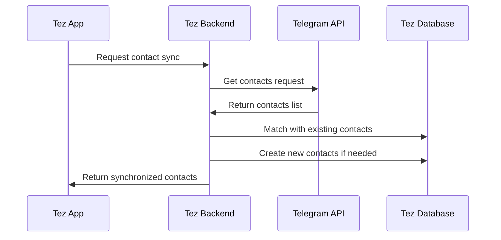

# Contact Synchronization

## Overview

This document outlines the process of synchronizing contacts between Telegram and the Tez CRM system. Effective contact synchronization ensures that sales representatives can seamlessly communicate with clients across platforms while maintaining comprehensive contact records.

## Synchronization Flow



## Implementation Steps

### 1. Retrieving Telegram Contacts

```javascript
async function fetchTelegramContacts(client) {
  try {
    // Get all contacts from Telegram
    const result = await client.invoke(
      new Api.contacts.GetContacts({})
    );
    
    // Extract and format contact information
    const contacts = result.users.map(user => ({
      telegramId: user.id.toString(),
      firstName: user.firstName || '',
      lastName: user.lastName || '',
      username: user.username || null,
      phone: user.phone || null,
      photo: user.photo ? {
        photoId: user.photo.photoId.toString(),
        dcId: user.photo.dcId,
      } : null
    }));
    
    return { success: true, contacts, count: contacts.length };
  } catch (error) {
    console.error('Failed to fetch Telegram contacts:', error);
    return { success: false, error: error.message };
  }
}
```

### 2. Mapping to CRM Contacts

```javascript
async function mapTelegramContactsToCRM(userId, telegramContacts) {
  try {
    const results = {
      created: [],
      updated: [],
      matched: [],
      failed: []
    };
    
    for (const telegramContact of telegramContacts) {
      // Try to find existing contact by Telegram ID
      let contact = await database.contacts.findFirst({
        where: {
          userId,
          telegramId: telegramContact.telegramId
        }
      });
      
      // If not found by Telegram ID, try phone number
      if (!contact && telegramContact.phone) {
        contact = await database.contacts.findFirst({
          where: {
            userId,
            phoneNumber: normalizePhoneNumber(telegramContact.phone)
          }
        });
      }
      
      if (contact) {
        // Update existing contact with Telegram info
        const updated = await database.contacts.update({
          where: { id: contact.id },
          data: {
            telegramId: telegramContact.telegramId,
            telegramUsername: telegramContact.username,
            telegramPhotoId: telegramContact.photo?.photoId || null,
            lastSyncedAt: new Date()
          }
        });
        
        results.updated.push(updated);
      } else {
        // Create new contact from Telegram data
        try {
          const created = await database.contacts.create({
            data: {
              userId,
              firstName: telegramContact.firstName,
              lastName: telegramContact.lastName,
              phoneNumber: telegramContact.phone ? normalizePhoneNumber(telegramContact.phone) : null,
              telegramId: telegramContact.telegramId,
              telegramUsername: telegramContact.username,
              telegramPhotoId: telegramContact.photo?.photoId || null,
              source: 'telegram',
              lastSyncedAt: new Date()
            }
          });
          
          results.created.push(created);
        } catch (createError) {
          results.failed.push({
            telegramId: telegramContact.telegramId,
            error: createError.message
          });
        }
      }
    }
    
    return {
      success: true,
      results: {
        created: results.created.length,
        updated: results.updated.length,
        failed: results.failed.length,
        createdContacts: results.created,
        updatedContacts: results.updated,
        failedContacts: results.failed
      }
    };
  } catch (error) {
    console.error('Failed to map Telegram contacts to CRM:', error);
    return { success: false, error: error.message };
  }
}
```

### 3. Contact Profile Enrichment

```javascript
async function enrichContactProfile(userId, contactId) {
  try {
    const contact = await database.contacts.findUnique({
      where: { id: contactId }
    });
    
    if (!contact || !contact.telegramId) {
      return { success: false, error: 'Contact not found or missing Telegram ID' };
    }
    
    const client = await getTelegramClientForUser(userId);
    
    if (!client) {
      return { success: false, error: 'Telegram client not available' };
    }
    
    // Get full user information
    const userInfo = await client.invoke(
      new Api.users.GetFullUser({
        id: contact.telegramId
      })
    );
    
    // Extract additional profile information
    const enrichedData = {
      bio: userInfo.fullUser.about || null,
      commonChats: userInfo.fullUser.commonChatsCount || 0,
      lastSeen: userInfo.user.status instanceof Api.UserStatusOnline 
        ? new Date() 
        : userInfo.user.status instanceof Api.UserStatusOffline 
          ? new Date(userInfo.user.status.wasOnline * 1000)
          : null,
      premium: userInfo.user.premium || false,
      profilePhoto: await downloadProfilePhoto(client, userInfo.user)
    };
    
    // Update contact with enriched data
    const updated = await database.contacts.update({
      where: { id: contactId },
      data: {
        telegramBio: enrichedData.bio,
        telegramLastSeen: enrichedData.lastSeen,
        telegramCommonChats: enrichedData.commonChats,
        telegramPremium: enrichedData.premium,
        telegramProfilePhotoUrl: enrichedData.profilePhoto,
        lastEnrichedAt: new Date()
      }
    });
    
    return { success: true, contact: updated };
  } catch (error) {
    console.error('Failed to enrich contact profile:', error);
    return { success: false, error: error.message };
  }
}
```

### 4. Managing User Privacy

```javascript
async function checkContactVisibility(client, telegramId) {
  try {
    // Attempt to get user's status to check if they're visible
    const statusResult = await client.invoke(
      new Api.users.GetUsers({
        id: [telegramId]
      })
    );
    
    if (!statusResult || statusResult.length === 0) {
      return { visible: false, reason: 'user_not_found' };
    }
    
    const user = statusResult[0];
    
    // Check if we can see their phone number
    const hasPhone = !!user.phone;
    
    // Check if we can see their status
    const hasStatus = user.status !== null && !(user.status instanceof Api.UserStatusEmpty);
    
    // Try to get full user profile
    try {
      const fullUser = await client.invoke(
        new Api.users.GetFullUser({
          id: telegramId
        })
      );
      
      return {
        visible: true,
        phoneVisible: hasPhone,
        statusVisible: hasStatus,
        bioVisible: !!fullUser.fullUser.about,
        photoVisible: !!user.photo
      };
    } catch (fullUserError) {
      // If we can't get full profile but have basic info
      return {
        visible: true,
        phoneVisible: hasPhone,
        statusVisible: hasStatus,
        bioVisible: false,
        photoVisible: !!user.photo,
        restrictedInfo: true
      };
    }
  } catch (error) {
    console.error('Failed to check contact visibility:', error);
    return { visible: false, reason: 'access_denied', error: error.message };
  }
}
```

## Bi-Directional Sync

### CRM to Telegram Sync

```javascript
async function addTelegramContact(userId, phoneNumber, firstName, lastName) {
  try {
    const client = await getTelegramClientForUser(userId);
    
    if (!client) {
      return { success: false, error: 'Telegram client not available' };
    }
    
    // Ensure phone is in international format
    const formattedPhone = formatInternationalPhone(phoneNumber);
    
    // Add contact to Telegram
    const result = await client.invoke(
      new Api.contacts.ImportContacts({
        contacts: [
          new Api.InputPhoneContact({
            clientId: BigInt(Date.now()),
            phone: formattedPhone,
            firstName: firstName || '',
            lastName: lastName || ''
          })
        ]
      })
    );
    
    if (result.users.length === 0) {
      return { success: false, error: 'No Telegram user found with this phone number' };
    }
    
    const telegramUser = result.users[0];
    
    // Update CRM contact with Telegram info
    const updated = await database.contacts.update({
      where: {
        userId,
        phoneNumber: normalizePhoneNumber(phoneNumber)
      },
      data: {
        telegramId: telegramUser.id.toString(),
        telegramUsername: telegramUser.username || null,
        telegramPhotoId: telegramUser.photo?.photoId?.toString() || null,
        lastSyncedAt: new Date()
      }
    });
    
    return { success: true, contact: updated };
  } catch (error) {
    console.error('Failed to add Telegram contact:', error);
    return { success: false, error: error.message };
  }
}
```

### Contact Photo Management

```javascript
async function downloadProfilePhoto(client, user) {
  if (!user.photo) {
    return null;
  }

  try {
    // Download profile photo
    const photo = await client.downloadProfilePhoto(user);
    
    if (!photo || photo.length === 0) {
      return null;
    }
    
    // Upload to storage service
    const fileName = `telegram_profile_${user.id}_${Date.now()}.jpg`;
    const uploadResult = await uploadToStorage(photo, fileName, 'image/jpeg');
    
    return uploadResult.url;
  } catch (error) {
    console.error('Failed to download profile photo:', error);
    return null;
  }
}
```

## Scheduled Synchronization

```javascript
async function scheduleContactSync(userId, frequency = 'daily') {
  try {
    const job = await database.syncJobs.create({
      data: {
        userId,
        jobType: 'telegram_contacts_sync',
        frequency,
        lastRunAt: null,
        nextRunAt: calculateNextRunTime(frequency),
        status: 'scheduled'
      }
    });
    
    // Add to job queue
    await jobQueue.add('contactSync', {
      userId,
      jobId: job.id
    }, {
      delay: calculateDelayMs(job.nextRunAt)
    });
    
    return { success: true, job };
  } catch (error) {
    console.error('Failed to schedule contact sync:', error);
    return { success: false, error: error.message };
  }
}

// Run the synchronization job
async function runContactSyncJob(job) {
  const { userId, jobId } = job.data;
  
  try {
    // Update job status
    await database.syncJobs.update({
      where: { id: jobId },
      data: { status: 'running', lastRunAt: new Date() }
    });
    
    // Get Telegram client
    const client = await getTelegramClientForUser(userId);
    
    if (!client) {
      throw new Error('Telegram client not available');
    }
    
    // Fetch contacts and sync
    const telegramContacts = await fetchTelegramContacts(client);
    
    if (!telegramContacts.success) {
      throw new Error(`Failed to fetch Telegram contacts: ${telegramContacts.error}`);
    }
    
    const syncResult = await mapTelegramContactsToCRM(userId, telegramContacts.contacts);
    
    // Update job with results and schedule next run
    await database.syncJobs.update({
      where: { id: jobId },
      data: {
        status: 'completed',
        lastResult: JSON.stringify(syncResult),
        nextRunAt: calculateNextRunTime(job.frequency)
      }
    });
    
    // Schedule next run
    await jobQueue.add('contactSync', {
      userId,
      jobId
    }, {
      delay: calculateDelayMs(calculateNextRunTime(job.frequency))
    });
    
    return syncResult;
  } catch (error) {
    console.error('Contact sync job failed:', error);
    
    await database.syncJobs.update({
      where: { id: jobId },
      data: { 
        status: 'failed',
        lastError: error.message,
        nextRunAt: calculateNextRunTime(job.frequency, true) // Try again sooner if failed
      }
    });
    
    // Schedule retry
    await jobQueue.add('contactSync', {
      userId,
      jobId
    }, {
      delay: calculateDelayMs(calculateNextRunTime(job.frequency, true))
    });
    
    return { success: false, error: error.message };
  }
}
```

## Frontend Implementation

### Contact Sync Settings Component

```jsx
function TelegramContactSettings() {
  const [syncStatus, setSyncStatus] = useState({
    lastSync: null,
    contactsCount: 0,
    isScheduled: false
  });
  const [syncFrequency, setSyncFrequency] = useState('daily');
  const [isLoading, setIsLoading] = useState(true);
  const [isSyncing, setIsSyncing] = useState(false);
  
  useEffect(() => {
    loadSyncStatus();
  }, []);
  
  async function loadSyncStatus() {
    setIsLoading(true);
    try {
      const response = await api.get('/telegram/contacts/sync-status');
      setSyncStatus(response.data);
      setSyncFrequency(response.data.frequency || 'daily');
    } catch (error) {
      console.error('Failed to load sync status:', error);
    } finally {
      setIsLoading(false);
    }
  }
  
  async function handleManualSync() {
    setIsSyncing(true);
    try {
      const response = await api.post('/telegram/contacts/sync');
      
      if (response.data.success) {
        setSyncStatus(prev => ({
          ...prev,
          lastSync: new Date().toISOString(),
          contactsCount: response.data.results.created + response.data.results.updated
        }));
        
        toast.success(`Sync completed: ${response.data.results.created} created, ${response.data.results.updated} updated`);
      } else {
        toast.error(`Sync failed: ${response.data.error}`);
      }
    } catch (error) {
      console.error('Failed to sync contacts:', error);
      toast.error('Failed to sync contacts');
    } finally {
      setIsSyncing(false);
    }
  }
  
  async function handleScheduleChange(e) {
    const newFrequency = e.target.value;
    setSyncFrequency(newFrequency);
    
    try {
      await api.post('/telegram/contacts/schedule-sync', {
        frequency: newFrequency
      });
      
      toast.success(`Sync scheduled: ${newFrequency}`);
    } catch (error) {
      console.error('Failed to schedule sync:', error);
      toast.error('Failed to schedule sync');
    }
  }
  
  // Render settings interface
  // ...
}
```

### Contact Merge Interface

```jsx
function ContactMergeModal({ isOpen, onClose, telegramContact, crmContact }) {
  const [mergedContact, setMergedContact] = useState({
    firstName: crmContact.firstName || telegramContact.firstName,
    lastName: crmContact.lastName || telegramContact.lastName,
    phoneNumber: crmContact.phoneNumber || telegramContact.phone,
    email: crmContact.email || '',
    company: crmContact.company || '',
    useTelegramPhoto: true
  });
  
  async function handleMerge() {
    try {
      const response = await api.post('/contacts/merge', {
        crmContactId: crmContact.id,
        telegramId: telegramContact.telegramId,
        mergedData: mergedContact
      });
      
      if (response.data.success) {
        toast.success('Contacts merged successfully');
        onClose(response.data.contact);
      } else {
        toast.error(`Merge failed: ${response.data.error}`);
      }
    } catch (error) {
      console.error('Failed to merge contacts:', error);
      toast.error('Failed to merge contacts');
    }
  }
  
  // Render merge interface with field-by-field selection
  // ...
}
```

## Best Practices

1. **Privacy First**: Always respect user privacy settings on Telegram
2. **Regular Syncs**: Schedule periodic syncs to keep contact information fresh
3. **Data Reconciliation**: Implement merge strategies for conflicting information
4. **Conflict Resolution**: Provide clear UI for resolving contact duplicates
5. **Metadata Enrichment**: Utilize Telegram data to enrich CRM contacts
6. **Photo Management**: Handle profile photo updates and storage efficiently
7. **Status Tracking**: Monitor and display contact online/offline status
8. **Performance Optimization**: Batch API calls for large contact lists

## Error Handling

| Error | Description | Resolution |
|-------|-------------|------------|
| PHONE_NUMBER_INVALID | Invalid phone format | Validate and format phone numbers before sync |
| FLOOD_WAIT_X | Rate limit exceeded | Implement backoff strategy and retry later |
| PRIVACY_RESTRICTED | User has restrictive privacy settings | Mark contact as limited and respect restrictions |
| PEER_ID_INVALID | Invalid Telegram ID | Refresh contact data or remove invalid mapping |
| CHANNEL_PRIVATE | Cannot access user data | Remove Telegram mapping and notify user | 