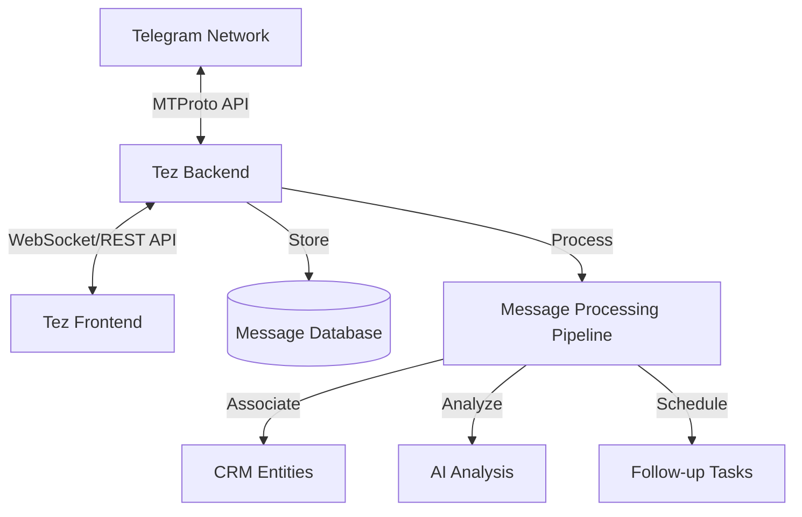

# Message Handling

## Overview

This document details how the Tez CRM platform handles, synchronizes, and processes messages between the CRM interface and Telegram. The system provides bidirectional message flow, ensuring that communication remains consistent across both platforms.

## Message Flow Architecture



## Message Synchronization

### Inbound Message Processing

1. **Real-time Updates**: Using Telegram's update mechanism to receive new messages
2. **Message Parsing**: Extracting content, metadata, and context from received messages
3. **CRM Association**: Linking messages to the appropriate contact, deal, or organization
4. **Notification Generation**: Creating alerts for new messages based on user preferences
5. **Read Status Tracking**: Maintaining consistent read/unread status across platforms

### Outbound Message Sending

1. **Message Composition**: Creating messages through the Tez interface
2. **Attachment Handling**: Processing files and media for Telegram compatibility
3. **Message Sending**: Transmitting messages through the Telegram API
4. **Delivery Confirmation**: Tracking and confirming message delivery status
5. **Sync to CRM**: Recording sent messages in the CRM communication history

## Implementation Details

### Listening for New Messages

```javascript
async function setupMessageListener(client, userId) {
  try {
    client.addEventHandler(async (update) => {
      if (update instanceof Api.UpdateNewMessage) {
        const message = update.message;
        
        // Process only if message is from a private chat
        if (message.peerId?.className === 'PeerUser') {
          await processIncomingMessage(userId, message);
        }
      }
    });
    
    console.log('Message listener established for user:', userId);
    return true;
  } catch (error) {
    console.error('Failed to setup message listener:', error);
    return false;
  }
}
```

### Processing Incoming Messages

```javascript
async function processIncomingMessage(userId, telegramMessage) {
  try {
    // Extract message details
    const senderId = telegramMessage.peerId.userId.toString();
    const messageContent = telegramMessage.message || '';
    const messageDate = new Date(telegramMessage.date * 1000);
    const messageId = telegramMessage.id.toString();
    
    // Check if message already exists in database
    const existingMessage = await database.messages.findUnique({
      where: { telegramId: messageId, userId: userId }
    });
    
    if (existingMessage) {
      return { status: 'duplicate', messageId };
    }
    
    // Find or create contact
    const contact = await findOrCreateContact(userId, senderId);
    
    // Store message in database
    const storedMessage = await database.messages.create({
      data: {
        userId: userId,
        contactId: contact.id,
        telegramId: messageId,
        content: messageContent,
        sentAt: messageDate,
        direction: 'inbound',
        readStatus: 'unread',
        // Include message media if present
        media: telegramMessage.media ? await processMessageMedia(telegramMessage.media) : null,
      }
    });
    
    // Associate with relevant deals if possible
    await associateMessageWithDeals(storedMessage, contact);
    
    // Send real-time notification
    await sendRealTimeUpdate(userId, 'new_message', {
      messageId: storedMessage.id,
      contactId: contact.id,
      preview: messageContent.substring(0, 100)
    });
    
    return { status: 'success', messageId: storedMessage.id };
  } catch (error) {
    console.error('Failed to process incoming message:', error);
    return { status: 'error', error: error.message };
  }
}
```

### Sending Messages

```javascript
async function sendTelegramMessage(userId, contactTelegramId, content, attachments = []) {
  try {
    const client = await getTelegramClientForUser(userId);
    
    if (!client) {
      throw new Error('Telegram client not available');
    }
    
    // Convert contact's Telegram ID to appropriate format
    const peer = await client.getInputEntity(contactTelegramId);
    
    // Send message
    const result = await client.invoke(
      new Api.messages.SendMessage({
        peer: peer,
        message: content,
        randomId: BigInt(Math.floor(Math.random() * Number.MAX_SAFE_INTEGER)),
        noWebpage: false
      })
    );
    
    // Process attachments if any
    if (attachments.length > 0) {
      for (const attachment of attachments) {
        await sendAttachment(client, peer, attachment);
      }
    }
    
    // Store in database
    const storedMessage = await database.messages.create({
      data: {
        userId: userId,
        contactId: await getContactIdFromTelegramId(userId, contactTelegramId),
        telegramId: extractMessageId(result),
        content: content,
        sentAt: new Date(),
        direction: 'outbound',
        readStatus: 'sent',
        // Store attachment references if present
        attachments: attachments.length > 0 ? JSON.stringify(attachments.map(a => a.id)) : null,
      }
    });
    
    return {
      status: 'success',
      messageId: storedMessage.id,
      telegramMessageId: extractMessageId(result)
    };
  } catch (error) {
    console.error('Failed to send Telegram message:', error);
    return { status: 'error', error: error.message };
  }
}
```

## Message Types and Content Handling

### Supported Message Types

1. **Text Messages**: Plain text content up to 4096 characters
2. **Media Messages**: Photos, videos, voice messages, and documents
3. **Location Sharing**: Geographical location data
4. **Contact Sharing**: Phone number and contact information
5. **Reply Messages**: Messages that reference previous messages
6. **Forwarded Messages**: Content forwarded from other chats

### Media Processing

```javascript
async function processMessageMedia(media) {
  if (media instanceof Api.MessageMediaPhoto) {
    return {
      type: 'photo',
      id: media.photo.id.toString(),
      sizes: media.photo.sizes.map(size => ({
        type: size.type,
        width: size.w,
        height: size.h,
        size: size.size
      }))
    };
  } else if (media instanceof Api.MessageMediaDocument) {
    const document = media.document;
    const fileName = document.attributes.find(
      attr => attr instanceof Api.DocumentAttributeFilename
    )?.fileName || 'unknown';
    
    return {
      type: 'document',
      id: document.id.toString(),
      mimeType: document.mimeType,
      size: document.size,
      fileName: fileName
    };
  }
  
  // Handle other media types as needed
  
  return { type: 'unknown' };
}
```

## CRM Integration

### Associating Messages with Deals

```javascript
async function associateMessageWithDeals(message, contact) {
  try {
    // Find active deals associated with this contact
    const activeDeals = await database.deals.findMany({
      where: {
        contacts: {
          some: {
            id: contact.id
          }
        },
        status: {
          not: 'closed'
        }
      }
    });
    
    if (activeDeals.length === 0) {
      return { status: 'no_deals' };
    }
    
    // Create message associations
    const associations = await Promise.all(
      activeDeals.map(deal => 
        database.dealCommunications.create({
          data: {
            dealId: deal.id,
            messageId: message.id,
            channel: 'telegram'
          }
        })
      )
    );
    
    return { status: 'success', dealCount: activeDeals.length };
  } catch (error) {
    console.error('Failed to associate message with deals:', error);
    return { status: 'error', error: error.message };
  }
}
```

### Message Analytics

The system tracks the following metrics for CRM insights:

1. **Response Time**: Time taken to respond to customer messages
2. **Message Volume**: Tracking communication frequency by contact/deal
3. **Conversation Length**: Measuring engagement through message count
4. **Topic Analysis**: AI-powered categorization of message content
5. **Sentiment Analysis**: Evaluating customer sentiment from messages

## Frontend Implementation

### Message Thread Component

```jsx
function MessageThread({ contactId }) {
  const [messages, setMessages] = useState([]);
  const [loading, setLoading] = useState(true);
  const [newMessage, setNewMessage] = useState('');
  const messageEndRef = useRef(null);
  
  useEffect(() => {
    loadMessages();
    
    // Set up real-time updates
    const socket = getWebSocketConnection();
    socket.on(`messages:${contactId}`, handleNewMessage);
    
    return () => {
      socket.off(`messages:${contactId}`, handleNewMessage);
    };
  }, [contactId]);
  
  async function loadMessages() {
    setLoading(true);
    try {
      const response = await api.get(`/messages/${contactId}`);
      setMessages(response.data.messages);
    } catch (error) {
      console.error('Failed to load messages:', error);
    } finally {
      setLoading(false);
    }
  }
  
  function handleNewMessage(message) {
    setMessages(prev => [...prev, message]);
    scrollToBottom();
  }
  
  function scrollToBottom() {
    messageEndRef.current?.scrollIntoView({ behavior: 'smooth' });
  }
  
  async function sendMessage() {
    if (!newMessage.trim()) return;
    
    try {
      await api.post(`/messages/send`, {
        contactId,
        content: newMessage,
        channel: 'telegram'
      });
      
      setNewMessage('');
    } catch (error) {
      console.error('Failed to send message:', error);
    }
  }
  
  // Render message thread UI
  // ...
}
```

## Error Handling

| Error | Description | Resolution |
|-------|-------------|------------|
| PEER_ID_INVALID | Invalid recipient ID | Verify contact mapping and refresh connection |
| FLOOD_WAIT_X | Rate limit exceeded | Implement exponential backoff for X seconds |
| MESSAGE_TOO_LONG | Message exceeds length limit | Split message or truncate with notification |
| MEDIA_INVALID | Invalid media format | Convert media to supported format |
| AUTH_KEY_UNREGISTERED | Authentication issue | Prompt user to reconnect Telegram account |

## Best Practices

1. **Rate Limiting**: Respect Telegram's API limits to avoid temporary blocks
2. **Message Batching**: Group message operations when processing historical messages
3. **Efficient Updates**: Use Telegram's update system instead of polling
4. **Caching Strategy**: Cache frequently accessed messages and contact data
5. **Error Recovery**: Implement retry mechanisms for transient failures
6. **Read Status Sync**: Maintain consistent read status between platforms
7. **Message Pagination**: Load messages in chunks for better performance
8. **Message Deduplication**: Prevent duplicate messages due to sync issues 